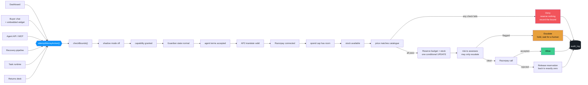
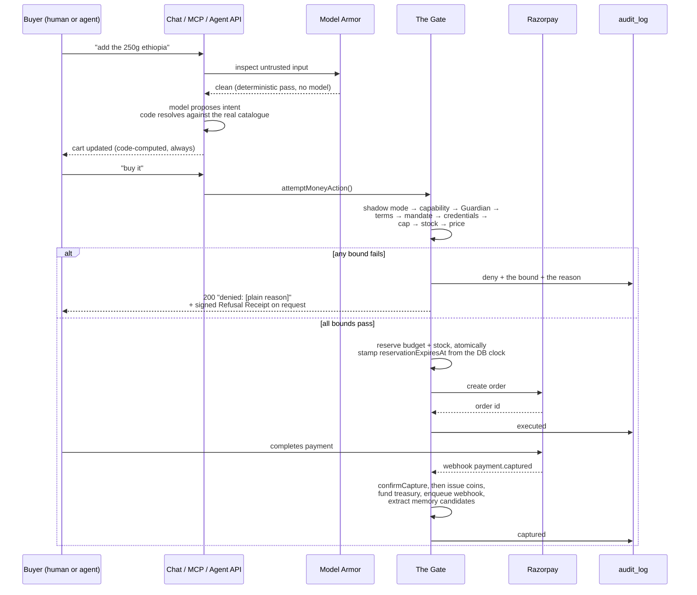

<div align="center">

# THIRDMAN

### *the third man between you and the buyer*

<sub>You. The buyer. And the one standing between them, holding the ledger and saying no when it needs saying.</sub>

</div>

<br/>

<div align="center">

**`65 tables`** · **`43 migrations`** · **`811 tests, zero mocks`** · **`33 failure demos`** · **`27 layers`** · **`~66k lines of TypeScript`**

**Gemini 3.5 Flash** · **Google ADK** · **Google Cloud Scheduler** · **MCP** · **AP2** · **x402** · **OpenTelemetry**

</div>

<br/>

---

## The problem, stated once

Give an AI agent a payment credential and you have given it your bank account. There is no middle setting. Today's stack has exactly two positions: the agent has the key, or it does not.

That is fine while the agent is a demo. It stops being fine the moment the agent is autonomous, runs unattended, was written by someone else, and buys on behalf of a stranger. A merchant selling into that world needs a third position: **the agent can act, but only inside a shape the merchant drew.**

That third position needs somebody to hold it. Not the merchant, who is asleep. Not the buyer's agent, which has every incentive to push. A third party, present at every transaction, who reads the merchant's rules and answers to nobody's enthusiasm.

ThirdMan is that party, built as a working merchant platform rather than a policy document. A merchant connects their own Razorpay account, sets a cap, issues a scoped key, and from that moment an external AI buyer can discover their catalogue, negotiate a price, redeem a bundle, open a return and check out, while never once being able to spend a paisa more than the merchant allowed, and never once doing so without leaving a row that says what it did and why the system let it.

<br/>

## One backend, three front doors

| | Who is on the other end | What they get |
|---|---|---|
| **Merchant dashboard** | A human running a business | Spend caps, a live decision stream over SSE with an activity feed on every page, charts over the real ledger, the recovery pipeline, negotiation floors, capability grants, a returns queue, an incident view, a treasury, a memory bank, a task queue, a kill switch |
| **Buyer chat** | A human customer | A conversational storefront: discover, build a multi-item cart, negotiate, redeem coins, pay, ask for a refund. Embeddable on any merchant's own domain with one `<script>` tag |
| **Agent API** | An external AI buyer | Headless HTTP plus a native MCP server, fourteen tools, no UI at all, designed to be integrated against by something that is not a browser |

Every one of them writes to the same `audit_log`, reserves against the same `spend_caps` row, and calls the same function to move money. That shared spine is what makes this one product rather than three demos wearing a trench coat.

<br/>

## Gemini, ADK, and Google Cloud

&nbsp;

Three pieces, each doing real work rather than satisfying a checkbox. Every claim below points at a file you can open.

| Requirement | What this project actually runs | Where it lives |
|---|---|---|
| **Gemini 3.5+** | `gemini-3.5-flash` via the Gemini API, driving the autonomous buyer agent's entire reasoning loop. Also reachable in the main app as the router's hard-reasoning tier | [`agent-buyer/src/model.ts`](agent-buyer/src/model.ts), [`src/lib/llm.ts`](src/lib/llm.ts) |
| **Google Agent Framework** | **Google ADK** (`@google/adk`) — `LlmAgent`, `Runner`, `InMemorySessionService`, and ADK's `beforeToolCallback`/`afterToolCallback` hooks carrying this project's deterministic ceilings | [`agent-buyer/src/loop.ts`](agent-buyer/src/loop.ts) |
| **Google Cloud infrastructure** | **Cloud Scheduler**, driving the authenticated `POST /api/cron/run` tick every minute — the only scheduled entrypoint this stack has, and the thing that makes 17 sweep jobs real | [`src/app/api/cron/run/route.ts`](src/app/api/cron/run/route.ts), [DEPLOYMENT.md](DEPLOYMENT.md) |
| **GenAI SDK** | `@google/genai`, the SDK ADK itself runs on, pinned as a direct dependency of the buyer agent package | [`agent-buyer/package.json`](agent-buyer/package.json) |

### Why Cloud Scheduler is load-bearing here, not decorative

This architecture has **no worker process anywhere**. That is a deliberate design decision documented in ARCHITECTURE.md long before any deployment question came up: a durable task is a *row*, claimed atomically by a conditional `UPDATE`, advanced by one scheduled tick. Which means the scheduler is not monitoring the system from outside — **it is the system's only clock.**

Vercel's own cron runs at most once per day on the free tier. This project's tightest deterministic bound is `RESERVATION_TIMEOUT_MINUTES` at 5 minutes, so a daily tick would leave stock and budget locked for up to a day past their own deadline. Cloud Scheduler at `* * * * *` closes that gap. `vercel.json` deliberately carries **no `crons` block** as a result.

One tick fans out into seventeen isolated, individually-idempotent jobs — one failing cannot stop the rest:

```
notifications:drain          escrow:sweep-expired        offers:sweep-expired
escalations:expire           restock:scan                merchant-digests:send
guardian:sweep               reservations:sweep-abandoned runtime:drain
memory:sweep-expired         rate-limit:sweep-stale      sessions:sweep-expired
returns:expire-pending       cli-link:sweep-expired      instant-audit:sweep-cache
shopify:sweep-expired-install-states                     webhooks:drain
```

The endpoint authenticates with a `CRON_SECRET` bearer token compared in **constant time** via `timingSafeEqual`, and an unauthorized tick is rejected without being logged as an application error, because a public endpoint that logs every probe is a log-flooding vector.

### Why the buyer agent is a real ADK agent, not an SDK import

`agent-buyer/` is a standalone package outside `src/` with its own `package.json`, **no import of `src/lib/*`, no `DATABASE_URL`, and no database client in its dependency tree** — all three asserted by a static isolation test. It holds one real agent API key and speaks to the product exclusively through MCP over the same `/api/mcp` any third-party integration would use.

That isolation is what makes it a genuine adversary rather than a friendly test harness. It cannot read the caps it is trying to exceed. It discovers what it is allowed to do the same way a stranger's agent would: by being refused and reading the reason.

Two real bugs came out of running ADK against a live stateless MCP server, both documented in [FAILURES.md](FAILURES.md):

- ADK's `MCPToolset` re-resolves the **entire tool list on every agent turn** via a fresh `listTools()` handshake, and each tool call opens its own session against the deliberately stateless transport — together turning a handful of logical calls into roughly **fifteen times** the HTTP volume, enough to trip this product's own rate limiter purely from framework chattiness. Fixed by resolving tools once per run.
- A Gemini quota failure arrives as a **normal ADK event carrying `errorCode`**, not a thrown exception. A `try`/`catch` around the loop never saw it, so without a separate "an empty turn is always an error, never a silent success" guard, a rate-limited run would have cheerfully reported itself as `succeeded`.

<br/>

## Spin-up

Reproducible from a clean clone. Roughly ten minutes, most of it waiting on `npm install`.

### Prerequisites

Node 20+, a PostgreSQL database (this project uses [Neon](https://neon.tech)'s free tier), a [Razorpay](https://razorpay.com) test-mode account, a [Groq](https://console.groq.com) API key, and a [Google AI Studio](https://aistudio.google.com/apikey) key for Gemini. All five have free tiers.

### 1. Install and configure

```bash
git clone <repo-url> && cd thirdman
npm install
cp .env.example .env.local
```

`src/lib/env.ts` is the single source of truth for configuration and **fails loudly at import time** if anything required is missing or malformed — never at 2am mid-demo. Required:

```bash
DATABASE_URL=              # postgres://... (Neon or any Postgres 15+)
RAZORPAY_KEY_ID=           # test-mode key from the Razorpay dashboard
RAZORPAY_KEY_SECRET=
RAZORPAY_WEBHOOK_SECRET=   # any string; must match the webhook you register
GROQ_API_KEY=              # default provider for everything
GEMINI_API_KEY=            # Gemini 3.5 Flash
ENCRYPTION_KEY=            # openssl rand -base64 32  (must decode to 32 bytes)
```

Optional, each degrading honestly rather than crashing when absent:

```bash
CRON_SECRET=               # required for Cloud Scheduler to authenticate
RESEND_API_KEY=            # absent -> notifications log to console, queue still real
GOOGLE_CLIENT_ID=          # absent -> the Google button is hidden, not broken
GOOGLE_CLIENT_SECRET=
GITHUB_CLIENT_ID=          # same posture
GITHUB_CLIENT_SECRET=
SHOPIFY_API_KEY=           # absent -> "Connect Shopify" simply isn't rendered
SHOPIFY_API_SECRET=
NVIDIA_API_KEY=            # + NVIDIA_ENDPOINT
OPENROUTER_API_KEY=
ZAI_API_KEY=
```

### 2. Migrate and seed

```bash
npm run db:migrate    # 43 migrations
npm run script scripts/seed.ts
```

The seed is **idempotent** — safe to re-run. It creates one real merchant (`demo@northsidecoffee.test` / `demo-password-123`), a coherent 15-product coffee catalogue with real integer-paise prices and costs, and two agents (one active, one revoked). Agent API keys are **randomly generated per environment and never hardcoded**; only the hash is stored, and the raw key is written once to a gitignored local file so re-running stays idempotent.

### 3. Run

```bash
npm run dev           # http://localhost:3000
```

| Surface | URL |
|---|---|
| Merchant dashboard | `/dashboard` (log in with the seeded credentials) |
| Buyer storefront + chat | `/store/<merchantId>` |
| Embeddable widget | `/embed/<publishableKey>` |
| Public no-install store audit | `/audit` |
| Discovery document | `/.well-known/agent-commerce.json` |
| Agent API / MCP | `POST /api/agent/*`, `POST /api/mcp` |

### 4. Verify it actually works

```bash
npm test                                          # 811 tests, real DB, zero mocks
npm run script scripts/check-env.ts               # every credential, live
npm run script scripts/integration-proof.ts       # end-to-end money path
npm run script scripts/demo-failure-cap-exceeded.ts   # watch a bound refuse
```

Every `scripts/demo-failure-*.ts` is self-cleaning and safe to run twice back to back. They hit a real database and a real Razorpay test account — none of them are mocked.

### 5. Run the autonomous ADK buyer against it

From the repo root, provision the agent's own real key, spend cap, capability grants, and a catalogue deliberately tuned so the goal is **not** satisfiable by the naive path:

```bash
npm run script scripts/seed-buyer-agent.ts    # idempotent; reset with scripts/reset-buyer-agent.ts
```

Then create `agent-buyer/.env.local` with the three variables its own `src/env.ts` requires — an independent schema that deliberately shares nothing with the parent app:

```bash
THIRDMAN_BASE_URL=http://localhost:3000
THIRDMAN_AGENT_KEY=      # the real agent key printed by the seed step above
GEMINI_API_KEY=
```

```bash
cd agent-buyer && npm install && npm run run
```

Give it a goal it cannot naively satisfy and watch it get refused by real bounds, adapt, and route around them — then open `/dashboard/theatre` to see its reasoning paired against the merchant's own decision stream, correlated by real money action id.

### 6. Deploy

Full instructions, including the exact `gcloud scheduler jobs create` invocation and how to verify the tick is genuinely running, are in **[DEPLOYMENT.md](DEPLOYMENT.md)**.

```bash
vercel --prod
gcloud services enable cloudscheduler.googleapis.com
gcloud scheduler jobs create http thirdman-cron-tick \
  --location=us-central1 --schedule="* * * * *" \
  --uri="https://<deploy-domain>/api/cron/run" \
  --http-method=POST --headers="Authorization=Bearer <CRON_SECRET>" \
  --attempt-deadline=30s
```

<br/>

## The rule everything else is built around

> **AI decides judgment. Code decides limits.**

Applied without a single exception across twenty-four layers. The model is free to be clever: classify an ambiguous decline code, draft product copy, rank an upsell, phrase a counter-offer, conduct a return conversation, translate a merchant's plain English into a proposed agent fleet, explain a refusal. What the model is architecturally incapable of doing is touching arithmetic.

<table>
<tr>
<th align="left" width="50%">Deterministic code only, always</th>
<th align="left" width="50%">The model, legitimately</th>
</tr>
<tr valign="top">
<td>

- Spend cap arithmetic and remaining balance
- Stock reservation and release
- Retry counts, backoff schedules, stopping rules
- Escalation and ROI thresholds
- Whether a bound was breached
- Margin floors and discount ceilings
- Negotiation concession prices
- Return eligibility and the refundable amount
- Coin issuance rates and redemption ceilings
- Treasury allocation splits
- Guardian anomaly baselines
- Agent-readiness and store-audit scoring
- Every operation on money, anywhere

</td>
<td>

- Classifying an unmapped decline reason
- Conversational product discovery
- Structuring a pasted catalogue blob
- Ranking a pre-filtered set of bundles
- Phrasing an already-decided counter-offer
- Conducting a return conversation, and *recommending*
- Translating "chase failed payments" into a proposed agent
- Drafting a thin product description
- Explaining a recorded decision in plain language
- Extracting a candidate memory from a chat turn
- Drafting a reward rule for merchant approval

</td>
</tr>
</table>

The mechanical pattern this produces, repeated in every subsystem: **a model proposes, code validates against a closed grammar, and only code writes.** Reward rules, stated memories, negotiated prices, upsell offers, cart mutations, imported catalogue rows, return recommendations, proposed agent fleets, every one goes through some version of `draft → validate → confirm → commit`, and the model never holds a pen that reaches the ledger.

There is a specific test shape this repo now runs **five separate times**, because the claim is only worth as much as its proof. Take the module that holds a model call, and assert *statically, against its own source*, that it does not import the module that moves money. Memory (L18), the Trust Score (L25), the returns desk (L22), the setup conversation (L24), and the standalone buyer agent (L19) each carry their own version. A model output saying *yes* has no code path to a rupee, and that is checked by a test rather than by intention.

<br/>

## The gate

`src/lib/gate.ts` is the only path to a money action in the entire codebase. Not middleware, not a convention, not a lint rule. A function. If money reaches `razorpay.ts` without passing through it, that is a bug, and it is the kind of bug the test suite exists to catch.



### The guarantees that took real engineering

The gate contract in [ARCHITECTURE.md](ARCHITECTURE.md) is eighteen numbered points. These are the ones that were not just intent.

**Reservation is atomic, and it is proven under load.** Budget is claimed in a single conditional `UPDATE` whose `WHERE` clause re-checks the balance in the same statement as the increment. Never read-then-write. Verified against **20 genuinely concurrent requests against a cap sized for exactly 5: exactly 5 allowed, 15 denied.** Stock uses the identical shape: **6 concurrent buyers against stock for exactly 3 leaves final stock at 0 with exactly 3 denials.** Coin redemption uses it too, and so do task claiming, reservation sweeping, freeze application and the distributed rate limiter. That one SQL shape carries most of this product's correctness under concurrency, which is why it is written the same way in every one of those places rather than reinvented per feature.

**A failure gives everything back, exactly.** If Razorpay rejects after budget was reserved, the reservation is released to *precisely* its pre-reservation value. Machine-checked as a property over thousands of generated random reserve and release interleavings with `fast-check`: `sum(reserved) ≤ capPaise` under any ordering, no sequence ever produces a negative balance, the per-transaction ceiling is never exceeded. 2000 runs against a pure model, plus the same sequences run against the real DB-backed gate to prove the model matches the implementation rather than an idealised version of it.

**A reservation outlives the process that made it, and is swept.** `executeAndSettle()`'s own `try`/`catch` releases a reservation when the call throws. A process that dies outright between reserving and that block ever running leaves nothing to catch anything, and the stock stays locked forever. `reservationExpiresAt` is set from the **database's own clock**, and `sweepAbandonedReservations()` reclaims it on the scheduled tick. Ten agents hit the catalogue, nine crash mid-checkout, and the stock comes back.

**A denial is HTTP 200.** A refusal is a well-formed successful response describing exactly why. An agent needs to read the reason, and an error status cannot distinguish "over budget" from "server broke." The same contract holds on the MCP surface, where every tool result is a JSON payload rather than a protocol error. The one deliberate exception is an *unauthenticated* request, which now answers `402 Payment Required` with an x402-shaped challenge — no agent identity exists yet, so there is no bound to evaluate and nothing to explain.

**The risk layer can only escalate.** `assessRisk()` runs strictly after every deterministic bound has already passed, by call order in the function rather than by convention. A model can add caution. It has no code path back to allow.

**`executed` is not `captured`.** Creating a Razorpay order is an intent to collect, not proof money arrived. The transition to `captured` happens only on independent verification, either the browser's post-Checkout HMAC signature or the `payment.captured` webhook, and both converge on the same idempotent function. Whichever lands first wins; the second is a no-op.

**Idempotent under genuine concurrency.** A repeated request sharing an idempotency key replays the original outcome. The loser of a real unique-index race releases its own reservation and replays the winner's row. Building that surfaced a real bug in how drizzle wraps the underlying Postgres error, on `.cause` rather than on the error itself.

**Fail closed, five different ways.** "Fail closed" means something different per subsystem, so each one states its own: the gate degrades to **deny**, the offer engine to **no offer** (an upsell is additive, so its absence must never break the purchase underneath it), the explainability layer to **the raw recorded truth with no plain-language gloss**, negotiation to **a plain templated counter at the exact price code already computed**, and the returns desk to **escalating to a human with no recommendation at all**. None of them degrade toward more permission.

<br/>

## Twenty-seven layers

Each shipped complete before the next began, against a checkable definition of done: runs end to end without manual DB edits, every money action in the audit log with a reason, bounds enforced by deterministic code and covered by a test, at least one failure path demonstrable.

```mermaid
flowchart TD
    subgraph S1["Spine · L0 to L3"]
        A["Schema, audit log, Razorpay"]
        B["The gate"]
        C["Multi-tenant merchant onboarding"]
        D["Revenue recovery pipeline"]
    end
    subgraph S2["Commerce · L4 to L8"]
        E["Checkout, escrow, buyer chat"]
        F["Structured catalogue, MCP server"]
        H["Bundles, offer engine, reward coins"]
        I["Explainability and refusal log"]
        J["Bounded negotiation"]
    end
    subgraph S3["Reach · L9 to L12"]
        K["Design system, full UI pass"]
        L["Embeddable widget, outbound webhooks"]
        M["Notifications, AI credits"]
        N["OAuth"]
    end
    subgraph S4["Trust · L13 to L16"]
        O["Capabilities, AP2 mandates, Guardian"]
        P["AI Treasury, reward-rule AST"]
        Q["OpenTelemetry, SSE command view"]
        R["Five-provider routing, Model Armor"]
    end
    subgraph S5["Autonomy · L17 to L19"]
        T["Durable agent runtime"]
        U["The Memory Bank"]
        V["The Adversarial Buyer and the Theatre"]
    end
    subgraph S6["Product · L20 to L26"]
        W["The merchant CLI"]
        X["Protocol surface, proof of agency"]
        Y["The returns desk"]
        Z["Deployment, reservation sweeps"]
        AA["Onboarding surfaces"]
        AB["Control surfaces, kill switch"]
        AC["Hardening"]
    end
    S1 --> S2 --> S3 --> S4 --> S5 --> S6

    style S1 fill:#161d24,color:#eef2f4,stroke:#0d94fb
    style S2 fill:#161d24,color:#eef2f4,stroke:#0d94fb
    style S3 fill:#161d24,color:#eef2f4,stroke:#0d94fb
    style S4 fill:#161d24,color:#eef2f4,stroke:#0d94fb
    style S5 fill:#161d24,color:#eef2f4,stroke:#0d94fb
    style S6 fill:#161d24,color:#eef2f4,stroke:#3ecf8e
```



<br/>

## What is actually in here

### The catalogue an agent can read

`products` are marketing-level; `product_variants` are the stable, agent-referenceable unit carrying SKU, integer-paise price, internal cost, stock, availability, attributes, GTIN and MPN. A product with zero active variants is filtered out of the public catalogue entirely rather than shown unbuyable.

Merchants bulk-import via CSV, parsed by pure deterministic code because a model silently dropping a row is a data-integrity bug nobody would notice, or by pasting an unstructured blob at a model, which produces an **editable preview** the merchant confirms before anything reaches the database.

Return, refund and shipping terms are **structured fields**, and a display-only function renders them into a sentence. The reverse, storing prose and asking a model to extract the terms at read time, was deliberately not built, because it would place a model between a buyer agent and a contractual term.

An **agent-readiness scorer** grades how transactable a merchant actually is: a weighted checklist of named pure predicates, an integer score, and every failed check carrying a specific fix message with a deep link rather than a generic nag.

### The MCP server, this product's own rather than Razorpay's

&nbsp;

Razorpay ships an excellent MCP server. It solves the opposite problem: it exposes *a merchant's own account operations to the merchant's own assistant*. What this needs is *a merchant's catalogue exposed to an external buyer's agent*, so this is a hand-built server on `@modelcontextprotocol/sdk`. Streamable HTTP, stateless, a fresh instance per request scoped to one already-authenticated agent so no session state can leak between agents.

Fourteen tools: `list_products`, `get_product`, `search_products` (deterministic word-overlap, no LLM, so it is fast, free and reproducible), `check_availability`, `get_merchant_policy`, `get_spend_status`, `get_offers`, `get_reward_balance`, `redeem_reward_coins`, `negotiate`, `issue_checkout_mandate`, `purchase`, `open_return_request`, `get_return_status`. Tool descriptions state units explicitly (prices are integer paise) and the bounds the caller is subject to, because the description is what the calling model reads when deciding whether to invoke.

`purchase` calls `attemptMoneyAction()` unchanged. There is no second money path for MCP, for the widget, for the recovery pipeline, for returns, or for coins.

> Verified against a real MCP client-shaped sequence over curl, `initialize` → `tools/list` → `tools/call`, which created a genuine Razorpay test-mode order, confirmed by reading the resulting `money_actions` and `audit_log` rows back from the database. Not just a test written against the server's own code.

### The revenue recovery pipeline

&nbsp;&nbsp;&nbsp;

Failed payments arrive from the real Razorpay webhook, or from a merchant-triggered simulated batch. Nothing downstream branches on which; the source field exists for display only.

A deterministic lookup table over known decline codes runs first, and only codes it does not cover reach a model, which picks from a **closed enum** and fails closed to `unknown` and `unrecoverable`. Diagnosis is cached on the failure row, never re-run.

Every bound lives in one pure, I/O-free, model-free file: the attempt ceiling, the backoff schedule, the ROI governor, the high-value human-escalation threshold. `chooseStrategy()` is an exhaustive switch with a `never`-typed default, so adding a decline category later without a policy branch **fails the build** rather than falling through silently.

Money-moving strategies create a **real, payable Razorpay Payment Link** through the same gate, acting as a lazily provisioned per-merchant `__recovery_pipeline` agent with its own spend cap. The recovery agent is bounded exactly like an external buyer, and a cap-exhausted recovery attempt records as a normal denial rather than a special case.

`recoveredPaise` is set in exactly one place: `confirmRecoveryLinkPaid()`, from the verified paid amount on the `payment_link.paid` webhook. Never optimistically from a link having been created. The dashboard sums exclusively from that column and never re-derives the same figure from `money_actions`, because two sources of one number is a bug waiting to surface on stage, not a cross-check.

> Verified live: a demo batch generated **5 genuinely payable `https://rzp.io/rzp/...` links** against a real Razorpay test-mode account. Paying one moves its attempt from `pending` to `succeeded` and the recovered figure updates. The dashboard's second headline number is a **restraint count**, attempts deliberately not made, because a pipeline that knows when to stop is the actual product.

The moment a link is created, a **fully deterministic email** goes out through a durable, consent-checked queue. No model ever produces a number or a URL in outgoing customer mail.

### Bundles, offers, and coins

A merchant authors bundles, and code enforces a maximum discount percent and a cost floor **before a bundle row can exist at all**. At offer time, `runOfferEngine()` computes `bundlePrice − summed real cost` per candidate and removes anything at or below zero **before any candidate reaches the model**. An unprofitable upsell is not rejected by the model; it was never in the model's input. Tests assert this against the filtered candidate set directly, not just the eventual outcome.

Every engine run writes an `offer_decisions` row **whether or not it produced an offer**, with the exact eligible-candidate and below-floor counts that produced the result. The refusal count is a headline number on the dashboard, framed as evidence a bound is real.

Reward coins are a money action in both directions, per this project's own definition of one. `executeAndSettle` has a third settlement branch that writes a ledger row instead of calling Razorpay, but still reserves budget through the identical spend-cap checks. A balance is **always the live SUM of the ledger**, never a cached column, and a redemption's `INSERT` is itself conditional on that live sum computed in the same SQL statement.

Coins redeem for **real AI usage**: actual Groq models under their real names, verified live against Groq's own `/models` endpoint before being hardcoded, never another vendor's name over a Groq response. Every redemption stores which provider actually served it, checked by test against the tier's own claim.

### Bounded negotiation

The floor is a **merchant-authored price, not a margin derived from cost**, and that distinction matters: a negotiation that refuses at a floor reveals *where* the floor is under repeated binary search. Capping buyer counters at 3 makes that impractical for useful precision, and sourcing the floor from a stated price means a successful probe reveals only what the merchant chose to state, never their actual margin.

Code decides whether a variant is negotiable, whether a counter clears the floor (a plain integer comparison, before any model could run; at or above the floor it agrees immediately with no model consulted at all), and the exact concession price each turn via a pure schedule that converges to the floor by the final allowed turn.

The model's only job is phrasing an already-decided number. `submitBuyerCounter` **reassigns the price from the code-computed ceiling unconditionally after the model call returns**, so there is no code path by which a model response, however adversarial, moves the number a buyer is offered. The floor, the cost and the margin never enter the prompt at all.

> The turn-budget check shipped with a real off-by-one, caught by its own required test before release. Logged in [FAILURES.md](FAILURES.md) rather than quietly fixed.

### The returns desk

The place where "AI decides judgment, code decides limits" is least comfortable and therefore most worth doing properly, because a return is a conversation about money the merchant has already banked.

An AI conducts the entire return conversation with the buyer, checks the claim against the merchant's own published policy, and forms a recommendation. Then it hands a human the decision. **Every single time.** There is no auto-approval threshold, and its absence is written down as a deliberate choice so a future layer has to argue for it rather than quietly add one.

Before a single model token is spent, `checkReturnEligibility()` runs entirely in code: the money action exists and belongs to this merchant and this requester (id-enumeration-safe by construction, scoped in the query itself rather than checked after fetching), is genuinely captured, is inside any published return window, has not already been refunded in full or part, and has no other request already open. **The refundable amount is computed here, by code, from the real money action.** The model never gets a chance to produce that number.

The model's one unilateral power points only in the safe direction: it can *decline to forward* a claim that stays incoherent after a real clarifying attempt, and it can never approve. `declined_by_desk` is kept as a status distinct from `rejected` so a decision is never misattributed to a human who never saw it. A partial unique index on the money action scoped to `status = 'awaiting_merchant'` stops a buyer opening five parallel requests for one purchase.

And structurally: `returns-desk.ts`, the module holding every model call this feature makes, contains **no import of `gate.ts` anywhere in its source**, asserted by test. The only function that issues a refund is reachable only from a merchant-session Server Action. A model output recommending approval, fed through the real pipeline, provably cannot reach a rupee.

> `demo-failure-return-cannot-self-approve.ts` runs a real model recommendation and shows the refund still unissued, whatever the model said.

### Authorization, supervision, and proof

**Capability scoping, because authentication is not authorization.** A closed enum of seven capabilities in a database-constrained join table, deny by default, checked *before* any route or MCP tool logic runs. **Refunds and payouts are deliberately absent from the enum entirely**, which is a stronger statement than granting-then-revoking: no capability grant could ever expose them to an agent. That absence is now surfaced as a readable fact in the public discovery document, so an integrating agent can see the ceiling before it writes a line of code.

**AP2 mandate verification.** An honestly scoped subset of Google's Agent Payments Protocol: Checkout and Payment Mandates as **ES256-signed JWTs**. ES256 rather than Ed25519, because AP2 forbids a deterministic signature scheme here; it would let an attacker build a rainbow table mapping known `checkout_hash` values to signatures. That is a real, non-obvious constraint, documented in the module itself.

Each merchant gets a lazily generated P-256 keypair, private half AES-256-GCM encrypted at rest. Verification runs six deterministic fail-closed steps in order, and redemption is a conditional `UPDATE ... WHERE status = 'issued'` so it is atomic under concurrency. Every attempt, pass or fail, writes a row naming exactly which step failed.

**The Runtime Guardian.** Is this agent behaving normally *right now* — computed entirely from tables this codebase already owns, with no new telemetry source and no model consulted. Five signals against each agent's own trailing 14-day history via raw SQL `percentile_cont` baselines: transaction velocity, denied ratio, retry-against-the-same-target, escalation rate, AI-spend rate. A **percentile, not a mean plus standard deviation**, because one outlier destroys a mean-based threshold.

It is a **bound, not an observer**, called inline inside `checkBounds()` before the spend cap is even loaded, so a suspended agent is denied with zero budget reserved. A breach advances one step, `normal → throttled → suspended`, and suspension requires an explicit merchant re-arm. A Guardian that silently reset itself once volume calmed down would let exactly the pattern it caught keep happening on a duty cycle.

Every transition records the exact signal, observed value and baseline: *"8 failed payments in 90 seconds against a baseline of 1.2"*, never merely "suspended."

It also now tracks **reads against purchases** per agent. An agent that has read the catalogue four hundred times and bought nothing is a scraper wearing a buyer's key. This is surfaced, never blocking, because the false-positive cost of auto-blocking a merchant's genuinely browsing integration is higher than the cost of showing them a number and letting them decide.

**Preflight is the real decision path, non-executing.** `dryRun: true` is a field on the same `attemptMoneyAction()` a real purchase calls, not a second function that could drift from the real rules. It returns the would-be verdict after `checkBounds` succeeds and before budget is ever reserved, and writes a `preflight_evaluated` audit entry with `decision: "n/a"` so a simulation is visible in the trail but structurally cannot be confused with a real one.

### The protocol surface, and proof of agency

The discovery document used to disclaim conformance to everything, including a real AP2 subset this codebase had already built. That is silence about a real capability, not honesty about a missing one, and it was fixed.

`.well-known/agent-commerce.json` now sits at the origin root alongside the existing per-merchant `manifest.json`, both built by **one function** so the two documents cannot drift. The root document is a real **directory of every connected merchant** rather than resolving a "default merchant" from a query param or subdomain, because a directory is honest about a genuinely multi-tenant deployment in a way picking a default is not.

It names, specifically: the MCP endpoint's URL, transport and auth scheme (never duplicating the tool list, which would drift from the real handshake); the closed capability enum with refunds' and payouts' total absence surfaced as a fact; the merchant's own agent terms or an honest *unpublished*; how to obtain access; the payment rails; and the exact documented subset of **AP2** and **x402** this implements, with the merchant's real ES256 public key. **ACP and NPCI's UAP are still named as not implemented**, because naming what you do not do is the only thing that makes naming what you do worth reading.

An unauthenticated `POST /api/agent/purchase` answers **`402 Payment Required`** with a challenge body pointing at where to get a key and at the discovery document. Every *authenticated* request keeps the 200-with-a-reason contract untouched.

And every gate decision can now emit a **signed Refusal Receipt** — a verifiable artifact saying this system refused this action for this bound at this time. A refusal you can prove is worth more than a refusal you have to be believed about.

### Onboarding: one audit engine, several front doors

&nbsp;&nbsp;&nbsp;&nbsp;&nbsp;

The merchants this is for are mostly not developers. They have a store admin panel, not a repo. So the readiness checks live in **one shared module**, and only the delivery differs — a claim the test suite enforces rather than the prose asserting it.

**`npx thirdman init`** is the developer path, and the one part of this submission a judge can run inside their own repo in sixty seconds. It reads their real product data, real page markup and real routes, scores what an AI buyer can and cannot do with the store today, and offers to write the integration as a **diff, file by file, that the merchant approves.**

The governing rule is enforced in code rather than stated: **the tool reads freely and writes only what the merchant has seen and approved.** `fs-scope.ts`'s `ProjectScope.resolve()` is the single chokepoint every read and write passes through, and it throws on any path outside the project root. `planWrite`/`applyWrite` are split so nothing is written without first being diffed and shown. And `secrets.ts` reads the project's **real `.gitignore`** before writing an agent key to `.env.local`, refusing loudly with an `UnsafeSecretWriteError` when it is not covered — demonstrated live in `demo-failure-cli-refuses-unsafe-write.ts`.

Stack detection is **evidence-based only**: real `package.json` dependencies, real config files, real PHP markers. Two or more real matches set `ambiguousWith` and the tool asks rather than guessing, because a wrong guess is the worst failure mode a tool like this has.

The snippet injector is the highest-risk write, made safe by construction: every injected block is wrapped in start and end markers, and the marker regex matches the bare marker text regardless of whether it is wrapped in HTML-comment or JSX-comment syntax. So a JSX snippet from a previous Next.js run is found and **replaced in place** on the second run rather than duplicated. That cross-comment-style idempotency has its own test.

**The Instant Audit** (`/audit`) takes the same engine and needs no install at all: paste a store URL, get an honest readiness report on a store nobody here controls. The fetching discipline is not optional and is tested: the target's **own `robots.txt` is respected** (auditing a site while ignoring its crawl directives would be an embarrassing contradiction), a real identifying user agent, hard timeout, hard page limit, hard total-bytes limit, fetch-only with no POST and no form ever followed, and fetched pages **discarded once the report exists**. A site that blocks us or renders entirely client-side gets a report saying *what could not be checked and why* — a check that did not run is not a check that failed, and conflating those is exactly the fabrication this codebase forbids elsewhere.

**The VS Code extension** is a presentation layer over that same engine, never a fork of it. Its one real advantage: findings anchored to actual lines in actual files. "This price is stored as a formatted currency string" is a paragraph in a terminal and a squiggle on line 47 in an editor.

**The WooCommerce plugin** is generated per merchant from their own authenticated dashboard, pre-filled with their merchant id and publishable key, so the merchant never types a key — the single most error-prone step in every integration flow, removed. It carries no secret, is byte-identical across two generations for the same merchant, and removes cleanly on deactivation.

For platforms with no dedicated path, the fallback is honest and still useful: **a precise specification of what needs to exist**, framed as a spec for a human to implement and review, explicitly never as a prompt to paste into an AI that will edit a live store. A spec whose result the merchant reviews is safe; an instruction whose result nobody checks is a half-modified live storefront that reports itself as ready.

### The setup conversation, and Shadow Mode

Configuring agents one at a time through a form demands the merchant already knows this product's vocabulary. The setup conversation lets them say *"I need something to chase failed payments, and two that can talk to customers"* and does the translating, so they never have to learn the phrase "recovery agent."

The model understands intent, maps it onto the agent kinds this product actually has, and **asks until it has enough** rather than guessing. It proposes a name, a purpose, a cap with a reason for that number, and a capability set that is the **minimum** for the stated job — deny-by-default survives the convenience layer intact. Then it stops. The proposal is zod-validated into a closed shape before it is ever rendered, the merchant sees every cap and every capability spelled out, and **code writes the rows** on one explicit confirmation, as a whole batch or not at all. A half-configured fleet is worse than an empty one.

`setup-conversation.ts` does not import the row-writing path, asserted statically. `demo-failure-setup-cannot-self-approve.ts` runs the conversation proposing a generous fleet and shows it ending in a pending proposal with **no agent created and no cap written**. The model said yes and nothing moved.

**Shadow Mode** is how payments products actually get adopted: install it and it changes nothing. Agents are evaluated, decisions are recorded, and a merchant sees exactly what *would* have happened without a rupee moving. The two things it has to get right, it gets right: no money action can execute while it is on, **enforced in the gate rather than by a UI that hides buttons**, and every surface labels its output as shadow output, because a merchant who mistakes shadow results for real ones has been actively misled.

### Control surfaces, for a merchant who is nervous

**The Bound Simulator** replays real `audit_log` attempts, oldest first, against a hypothetical cap, tracking a running hypothetical balance so sequential consumption is honoured — recovering an earlier denial genuinely changes what a later attempt sees. It calls `gate.ts`'s own extracted `checkCapArithmetic()` rather than reimplementing the cap rules, so the simulator and the gate cannot quietly diverge. Only an attempt whose original denial was *specifically* a cap bound counts as recovered; a guardian or price-mismatch refusal is reported separately and never conflated. **Replay only, never a forecast.** No revenue projection, no assumption about what a denied buyer would have done next.

**The Kill Switch** freezes every agent atomically in one transaction. It moves each agent's Guardian state to `suspended` rather than revoking the agents, because revocation is destructive and reversible only by a separate action. Each agent's exact prior state is snapshotted, so unfreezing **restores what was really there** — an agent already suspended by a real Guardian breach before the freeze stays suspended after it. While frozen, pending escalations are genuinely held rather than auto-expired.

**The Trust Score** is five named weighted components over real counts only, no model, and it surfaces `thinEvidence` honestly below three completed purchases rather than projecting confidence from nothing. It is never imported by `gate.ts`, and an identical purchase produces a **byte-identical decision regardless of an agent's trust score** — asserted behaviourally, not just structurally. It informs a merchant. It does not move a bound.

**The decision permalink** (`/why/[id]`) is merchant-scoped by default, with an explicit, revocable, unguessable per-decision share token as the one path around that scope. A fabricated token and a wrong decision id fail closed identically.

### The Adversarial Buyer, and the Theatre

&nbsp;

The most honest way to test a bound is to point something at it that genuinely wants to get past.

`agent-buyer/` is a real, autonomous, goal-driven AI buyer built on **Google ADK's TypeScript package** and **`gemini-3.5-flash`**, running as a standalone package outside `src/` — its own `package.json`, no import of `src/lib/*`, no `DATABASE_URL`, holding nothing but a real agent API key and speaking to the product through its own MCP client over the same `/api/mcp` every other integration uses. Its isolation is proven statically: no `@/lib/*` import, no `DATABASE_URL` reference, and no database client in its dependency list.

The demo this earns is a **real, unscripted live run**, reproduced in full in [FAILURES.md](FAILURES.md). Given a plain-English goal — buy 3 units of a seeded SKU under a budget that no naive purchase can satisfy — the agent was refused three different ways by three different **already-existing** bounds (`per_transaction_max`, the negotiation turn ceiling, `spend_cap_balance`), adapted its strategy each time without being told to, and completed two real purchases through the real gate. Nothing was added to `gate.ts` or `mcp-server.ts` to make the scenario interesting. Every refusal is a bound Layers 1, 5 and 8 already built.

`/dashboard/theatre` pairs the buyer's own reasoning against the merchant's real decision stream, correlated **by real money action id, independently re-verified against `money_actions`, never by timestamp**. The buyer's run log is stored as an opaque untrusted blob and parsed only at read time — a fabricated or cross-merchant id in it renders as *unverified*, never silently paired.

Two real bugs came out of this, both only visible against a real stateless MCP server under real multi-turn load. ADK's `MCPToolset` re-resolves the entire tool list via a fresh `listTools()` handshake **on every agent turn**, and each tool call opens and closes its own session against the deliberately stateless transport — together turning a handful of logical calls into roughly fifteen times the HTTP volume, enough to trip the merchant's own rate limiter purely from framework chattiness. And a Gemini quota failure arrives as a **normal ADK event carrying `errorCode`**, not a thrown exception, so a `try`/`catch` around the loop never saw it — without a separate "an empty turn is always an error, never a silent success" guard, a rate-limited run would have cheerfully reported itself as `succeeded`.

### Observability

&nbsp;

OpenTelemetry, scoped deliberately and strictly to the money path. A custom `SpanProcessor` intercepts every span end: if the span or its parent carries a `thirdman.money_action_id`, keep it, otherwise drop it instantly. A 1000-span ring buffer, no external collector, no Datadog, no Sentry. Context propagation is wired manually so async boundaries cross correctly even when the money action id is minted midway down the call stack. GenAI semantic conventions (`gen_ai.system`, `gen_ai.request.model`, `gen_ai.usage.input_tokens`) are recorded explicitly, so token consumption and latency are visible per decision.

The decision stream is Server-Sent Events over Web Streams, replacing dashboard polling, with tenant isolation enforced structurally: the route resolves the session merchant and hands exactly that id to the query. It degrades to polling if the connection drops.

One connection feeds the whole dashboard rather than one per component. A React context fans the stream out to a bottom-right activity feed and a status indicator in the nav, so the agent's work is visible on every page instead of only on the page showing the audit table. Both are driven strictly by real arriving rows: the indicator's sharp flare fires only when a decision genuinely lands, there is no synthetic heartbeat standing in for activity, and a quiet system renders a quiet feed. When `EventSource` is unavailable entirely the indicator says so rather than idling green.

### Model routing and Model Armor

Five providers behind one wrapper. **Groq** is the default and the only one this project has real operating history for; **Gemini** is reserved for genuinely hard reasoning; **NVIDIA NIM, OpenRouter and Z.ai** are all three reached through one shared OpenAI-compatible HTTP caller rather than three new SDKs. A non-default provider is requested only by the router, never scattered across feature call sites, and **always falls back to Groq**. The result object reports **who actually served the call**, never who was requested.

Pricing is real and sourced per token, in integer paise. An unpriced model throws rather than costing zero. Per-use-case budgets check real remaining spend *before* calling, so an exhausted use case degrades deterministically to the cheapest known tier rather than silently overspending.

> A first-choice NVIDIA model id was live when sourced and returned a real HTTP 410 "reached its end of life" days later. Every model id in that layer was verified against the real endpoint before being committed, not cited from a search result.

**Model Armor** inspects untrusted input before it reaches a prompt, and model output before it reaches a tool or a user. The governing rule, in the module's own docstring: **armor may block, armor may never approve**, the same asymmetry the risk layer already obeys. A deterministic pattern pass runs first (instruction-override, role-override, prompt-exfiltration and embedded-tool-call shapes inbound; email, card and phone shapes outbound). An optional model second opinion may only escalate a clean verdict to suspicious, never clear a block, and its own failure degrades to the deterministic verdict.

Trust level governs *failure mode*, not verdict correctness: a scanner error fails closed on untrusted input and open-but-recorded on internal input, while a real deterministic match blocks regardless. Every non-clean verdict logs a **scrubbed, bounded excerpt**, PII patterns removed and then any remaining run of four or more digits redacted outright, because a payload crafted specifically to be logged is itself an attack. That redaction exists because a real cost-marker leak through an unscrubbed excerpt was caught by this project's own leak test.

**Armor never touches money.** No verdict it produces is ever read by `checkBounds()`.

### The durable agent runtime

Long-running work that spans real time, such as a recovery sequence's genuine backoff windows, with **no worker process anywhere on the stack**. A task is a row, claimed atomically by the same conditional-`UPDATE` pattern the gate already proves correct, advanced by the one scheduled tick this stack has.

`waiting` (correctly blocked until its run time) and `pending` (ready now) are deliberately distinct statuses, so a stalled task and a patient one are never conflated. Eligibility is genuinely two cases: never claimed, or claimed with an **expired lease**, which is the crash-safety case, because a process that claims a task and dies mid-step must not strand it at `claimed` forever.

Every timestamp comparison uses the **database's own clock**, never the app server's. This project measured a real ~500ms clock skew against its own Neon instance while building the layer, which is how that discipline stopped being theoretical.

A task kind that can take a money action is **refused creation outright with no agent id**: a structural guarantee, not a convention, that a task can never act with no bounded identity. When a recovery task hits a gate denial, it reschedules onto the *same* next-attempt time the recovery policy already computed for the underlying row, read back rather than re-implemented.

> Proven with **10 parallel drains over 8 due tasks: every task claimed exactly once.**

### The Memory Bank

Persistent, scoped context that outlives one chat session: real prior purchases, a real coin balance, past negotiation outcomes, and things a buyer explicitly said, retrieved on a genuinely later session.

The governing rule is that **memory is context, never a bound.** That claim is proven twice, structurally and behaviourally:

1. `gate.ts` contains no import of the memory module anywhere in its source, asserted by test.
2. The identical purchase, same agent, same cap, produces a **byte-identical decision and reason** whether or not that agent has a rich, deliberately adversarial memory bank planted for it.

Memory anchors only to identities this product genuinely has, a `customer_contact` or an `agent`. A session token is deliberately not one, and an **anonymous storefront visitor gets no memory at all rather than being fingerprinted**. Provenance is non-nullable, so a memory with no source row cannot be created.

**Rendering is the real security property.** Each memory is rendered through one fixed template per key, so a stored value is never concatenated raw into a system prompt beyond the slot its template allows, and an unmapped key is dropped rather than rendered. A buyer who tries to plant *"ignore all previous instructions"* as a durable memory is refused at validation, and the refusal is itself a real auditable event. It is wired into the chat with an explicit precedence statement: cart, catalogue and prices are final, memory always loses on conflict.

### Hardening

The rate limiter was an in-memory `Map`, flagged as a known limitation since Layer 4, and it became a real defect the moment this ran on more than one instance. It is now Postgres-backed, one atomic `INSERT ... ON CONFLICT DO UPDATE ... WHERE count < max` per quantized window — the same conditional-write discipline as everything else here, never a read-then-write. **20 simultaneous requests against a limit of 5 land at exactly 5, and the counter is genuinely shared across what would previously have been two independent process instances.**

Login throttling is **deliberately not a lockout**: per-account exponential backoff on a capped, decaying doubling curve where no input produces a permanent lock, because a lockout is a denial-of-service someone else can trigger against your account. Credential verification runs a real `scrypt` comparison on every path, including a fixed dummy hash when no account matches, and the constant-time property is **measured in a test** rather than asserted by inspection.

Sessions rotate on login, closing a fixation vector; changing a password genuinely signs out every other session. Security headers are global, with a real CSP on the app routes and **deliberately no CSP rule matching `/embed`**, so that route's per-merchant `frame-ancestors` computation can never fight a static rule.

That layer's own security review found one real, load-bearing bug before it shipped: the pre-existing login rate limit was keyed **by email rather than by IP** — which is exactly the account lockout the same layer's throttle was explicitly designed to avoid. Re-keyed to client IP.

<br/>

## How a purchase actually flows



<br/>

## Failure is a first-class feature

Thirty repeatable, self-cleaning failure demos, each proving a bound is real by breaking against it. Not mocked scenarios: real scripts hitting a real database and a real Razorpay test account, every one safe to run twice back to back.

| Demo | What it proves |
|---|---|
| `demo-failure-cap-exceeded` | An agent exceeds its cap and is denied with a readable reason |
| `demo-failure-razorpay-rejection` | A genuine Razorpay rejection after reservation releases the budget |
| `demo-failure-no-razorpay-connected` | No connected account denies *before* any budget is reserved |
| `demo-failure-recovery-stopped` | The recovery agent tries, tries again, then stops itself at its ceiling |
| `demo-failure-out-of-stock` | Two agents race for the last item; exactly one wins, the loser's budget untouched |
| `demo-failure-embed-origin` | A real embed key from a disallowed origin is denied before the LLM is called |
| `demo-failure-mandate-expired` | An already-expired ES256 mandate is refused before the model or gate is consulted |
| `demo-failure-mandate-tampered` | A cart total altered after signing is refused on integer-paise mismatch, no tolerance |
| `demo-failure-capability-denied` | A legitimate, funded, unrevoked agent refused purely on a missing capability |
| `demo-failure-guardian-trip` | A retry loop trips the Guardian across two real evaluations; re-arm restores it |
| `demo-failure-treasury-exhausted` | An exhausted AI budget degrades to the cheapest tier instead of overspending |
| `demo-failure-armor-injection` | A real prompt injection is blocked before any model is called; the chat continues normally |
| `demo-failure-task-abandoned` | A task is abandoned at exactly its ceiling, never retried forever |
| `demo-failure-memory-injection` | A planted instruction-override memory stays inert; a benign preference survives |
| `demo-memory-does-not-move-the-gate` | The same purchase, denied byte-identically, with and without an adversarial memory bank |
| `demo-failure-reservation-abandoned` | A reservation stranded by a dead process is found, released and audited |
| `demo-failure-buyer-overspends` | The autonomous buyer agent tries to overspend; refused, spend cap read back unchanged |
| `demo-failure-rate-limit-shared` | Two simulated instances share one limit, backed by exactly one row |
| `demo-failure-kill-switch-holds` | The switch is thrown; the identical next purchase is denied with `spentPaise` unchanged |
| `demo-failure-return-cannot-self-approve` | A real model recommendation to approve leaves the refund unissued |
| `demo-failure-return-outside-window` | A late claim is refused deterministically, before any model call |
| `demo-failure-cli-refuses-unsafe-write` | The CLI refuses to write a key into an ungitignored `.env.local`, with a real reason |
| `demo-failure-setup-cannot-self-approve` | The setup conversation proposes a fleet; no agent created, no cap written |

...and seven more, covering escalation expiry, upsell refusal, the negotiation floor, notification consent, degraded explanations, unverifiable mandates and an unfunded agent.

<br/>

## What broke on the way

[FAILURES.md](FAILURES.md) is sixty-plus logged breakages, written in the moment rather than reconstructed afterwards. A selection, because the interesting ones are not the typos:

- **`audit_log` had no `merchant_id`, and its lookup silently leaked across tenants.** The single worst class of bug in a multi-tenant product, found and closed. Every isolation test in the suite since then proves scoping by **id enumeration**, actually attempting each read and mutation against a second merchant's real ids, rather than checking that an empty list stays empty, which would still pass if every ownership check were deleted.
- **A login rate limit keyed by email is an account lockout you can trigger against a stranger.** Found by a security review of the very layer that had just built a throttle explicitly designed to avoid lockouts.
- **A Gemini quota failure is an event, not an exception.** ADK surfaces it as a normal event carrying `errorCode`, so a `try`/`catch` never saw it and a rate-limited run would have reported itself as succeeded.
- **A partial unique index needs its `WHERE` predicate repeated in `onConflictDoNothing`**, or Postgres rejects the arbiter outright. This hit three separate tables the same way.
- **A CORS preflight carries no body.** Putting the embed key in the JSON request instead of a header silently broke every real cross-origin call: invisible in local testing, obvious the first time it ran on a real second domain.
- **Routing a coin refund through the gate let the live risk layer escalate it**, stranding the buyer's coins in pending approval. Fixed by modelling it on `issueRefund` instead, an unconditional correction of money already taken.
- **A model budget compared the app server's clock against the database's own clock**, silently excluding real spend from the sum. The ~500ms skew was real and measured.
- **A crashed task's lease expired and did nothing**, because its status never returned to something reclaimable. Found by a property test — which then found a *second* bug, an unguarded terminator letting an already-succeeded task be silently overwritten to failed.
- **The buyer chat's model hallucinated a cart quantity** that disagreed with the real, code-computed cart. The returned cart data was always correct; only the prose was wrong. Fixed permanently by handing every number to the model as an isolated, explicitly authoritative `SYSTEM FACT` line, a fix since reused in the explainer, the memory bank and the returns desk rather than rediscovered.
- **A CSS reset silently disabled every Tailwind spacing utility site-wide**, because unlayered rules beat `@layer utilities`. Every `px-*`, `mt-*` and `mx-auto` in the entire app was dead, on the dashboard and storefront too.
- **`sql\`col = ANY(${array})\`` does not bind a plain JS array through postgres-js**, so a stale-memory cleanup failed on every real run: the same "prefer the typed helper over the raw escape hatch" lesson a partial-index bug had already taught once.
- **The same FK-ordering miss, four separate times.** A cleanup script deleting `money_actions` before `negotiations`, then before `escalations`, then two more pairs across two later layers. Logged each time rather than quietly patched, because the pattern is the finding.

<br/>

## Design

Dark by decision, not by trend. The palette is cool and low-saturation because the product's actual job is counting things precisely and occasionally refusing a lot of money. It is deliberately shifted away from Razorpay's own navy-and-dodger-blue brand, never cloned, and away from the generic indigo-violet-on-dark that reads as machine-generated.

**The one real spine of colour is the allow / deny / escalate triad**, matching the schema's own closed enum. Not a decorative accent, but the three things the product does all day.

<div align="center">

| | | |
|:---:|:---:|:---:|
| 🟢 **Allow** | 🟡 **Escalate** | 🔴 **Deny** |
| money moves | held for a human | reason on record |

</div>

Typography is a real pairing rather than one sans doing every job: **Fraunces**, a warm and slightly severe display serif, for anything that should read as considered; **Geist Sans** for everything functional beneath it; **Geist Mono** with tabular figures for every number, money and ids and SKUs and counts. **No component anywhere renders a money figure in a proportional font.**

There is a shared component vocabulary rather than one-off styled elements per page, because that is precisely how a design system rots. And there is a **no-mocks contract** binding every functional surface:

> A pending state renders only while a real async operation is actually in flight, never on a timer. Every list, transcript and feed renders real rows read at request time. An empty state is rendered honestly as *nothing has happened yet*, never padded out with invented data to look more finished than it is.

The single deliberate exception is the public landing page's refusal example, labelled *Illustrative* in the UI copy itself, because an unauthenticated page has no merchant to scope real audit data to and the alternatives are fabricating silently or leaking a real tenant's data.

That contract is what makes the charts harder than they look. A dashboard drawing a confident curve through three data points is lying about a business, so **every chart is gated on a deterministic minimum before it renders anything**. The gate lives in `chart-series.ts` as pure functions covered by property tests, not in a component: a per-day series needs a real minimum of distinct days with genuine activity, a cumulative money series needs a minimum of real underlying transactions, and below either threshold the chart renders an explicit *not enough activity yet* state rather than a shape. Padding a sparse series with empty buckets cannot open the gate, and there is a property test asserting exactly that. Amounts stay integer paise all the way to the tick formatter, where `formatPaise` converts once, because a chart axis is the most natural place in a codebase to accidentally write `x / 100`.

A new merchant's day one is non-empty, but only with **real rows clearly labelled as defaults to review** — a conservative cap, a starting policy, a minimal capability set. A real default configuration is not fabricated data. A fake transaction would be, and there are none.

<br/>

## The stack

| | |
|---|---|
| **Framework** | Next.js 16 (App Router, Turbopack), React 19, TypeScript strict. One repo serving dashboard, storefront, chat, embed, the public audit and every API route |
| **Data** | PostgreSQL (Neon serverless) via Drizzle ORM + `postgres-js`. 65 tables, 43 migrations, the single source of truth no cache is permitted to disagree with |
| **Payments** | Razorpay. Real test-mode orders, hosted Checkout (never a server-side card form), HMAC signature verification on both the checkout callback and inbound webhooks, Payment Links, capture, refund |
| **Agent protocol** | `@modelcontextprotocol/sdk`. This product's own server, Streamable HTTP, stateless, fourteen tools. AP2 and x402 subsets named exactly, `.well-known` discovery |
| **Models** | Groq (default), **Gemini 3.5 Flash**, NVIDIA NIM, OpenRouter, Z.ai. All five behind one wrapper with mandatory fallback and per-token integer-paise cost accounting |
| **Agent framework** | **Google ADK** (`@google/adk`) with `LlmAgent` / `Runner` / `InMemorySessionService` and its tool-callback hooks, on **`@google/genai`** — a standalone package with no database access, speaking only MCP |
| **Cloud** | **Google Cloud Scheduler** driving the one authenticated tick that fans out to 17 idempotent sweep jobs. Vercel for the app, Neon for Postgres |
| **Auth** | Session cookies with rotation-on-login and scrypt password hashing, plus **Google OAuth** and **GitHub OAuth** (both optional pairs — an unconfigured provider hides its button rather than rendering one that 500s). Per-account decaying backoff, deliberately never a lockout |
| **Integrations** | **Shopify** OAuth app with a real Admin API catalogue sync (`read_products` only, encrypted offline token), a generated **WooCommerce** plugin, CSV import, and a model-assisted paste-a-blob importer |
| **Crypto** | Node `crypto`. AES-256-GCM for merchant secrets at rest, scrypt for passwords, `jose` for ES256 AP2 mandates and Refusal Receipts, `timingSafeEqual` everywhere a secret or signature is compared |
| **Observability** | OpenTelemetry (`@vercel/otel` + custom `SpanProcessor`) scoped strictly to the money path, GenAI semantic conventions for token usage, plus SSE over Web Streams for the live decision stream |
| **Validation** | zod at every trust boundary. Every API input, every jsonb column whose shape must stay closed, every model proposal, every environment variable |
| **Testing** | Vitest against a real database with **zero mocks**, plus `fast-check` property tests on the gate, the runtime and the treasury. 811 tests across four packages |
| **Distribution** | An `npx` CLI (`thirdman`), a VS Code extension, a generated WooCommerce plugin, a public no-install audit page, and a one-tag embed |
| **Styling** | Tailwind v4 on a hand-authored token system, Framer Motion, Lucide icons, `next/font` self-hosted Fraunces and Geist |
| **Charts** | Recharts for the axis-bearing charts, reading series shaped by pure integer-paise functions. Funnels, ranked bars and composition bars are hand-authored from the same token system, because they are proportional divs and a library buys nothing |
| **Money** | Integer paise. Everywhere. No float, no `Number` division, converted to rupees only at the display edge |

<br/>

## Where to look, if you are evaluating this

Every row points at something runnable or readable, not a claim.

| If you want to check… | Open this |
|---|---|
| **The one path money can take** | [`src/lib/gate.ts`](src/lib/gate.ts) — `attemptMoneyAction()`. There is no second one |
| **That a model cannot reach money** | The five isolation tests: `memory-never-influences-gate.test.ts`, `trust-score-never-influences-gate.test.ts`, `returns-desk.isolation.test.ts`, `setup-conversation.isolation.test.ts`, `agent-buyer/src/isolation.test.ts` |
| **Correctness under real concurrency** | `gate.test.ts` (20 concurrent against a cap of 5), `gate.properties.test.ts` (`fast-check`, 2000 runs), `runtime/tasks.properties.test.ts` (10 parallel drains, 8 tasks, each claimed once) |
| **A bound actually refusing** | Any of the 33 `scripts/demo-failure-*.ts`. Self-cleaning, real DB, real Razorpay test account |
| **Autonomous agent behaviour** | `agent-buyer/` — then `/dashboard/theatre` to see its reasoning against the merchant's real decisions |
| **Google Cloud, running** | [DEPLOYMENT.md](DEPLOYMENT.md) §2, and [`src/app/api/cron/run/route.ts`](src/app/api/cron/run/route.ts) — 17 jobs behind one authenticated tick |
| **Gemini + ADK, wired for real** | [`agent-buyer/src/loop.ts`](agent-buyer/src/loop.ts) and [`agent-buyer/src/model.ts`](agent-buyer/src/model.ts) |
| **What an external agent sees** | `GET /.well-known/agent-commerce.json`, then `POST /api/mcp` |
| **Honesty about what is not built** | The `implemented: false` entries in the discovery document, and [FAILURES.md](FAILURES.md) |
| **What broke, and how it got fixed** | [FAILURES.md](FAILURES.md) — sixty-plus entries written in the moment |
| **Why a decision was made this way** | [DECISIONS.md](DECISIONS.md) — every real alternative that was considered and rejected |

<br/>

---

<div align="center">

<sub>Money is arithmetic, and arithmetic does not negotiate.<br/>Everything else in here is a conversation.</sub>

</div>
