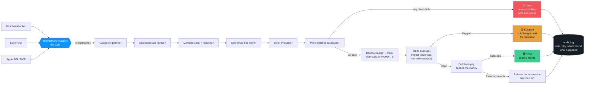
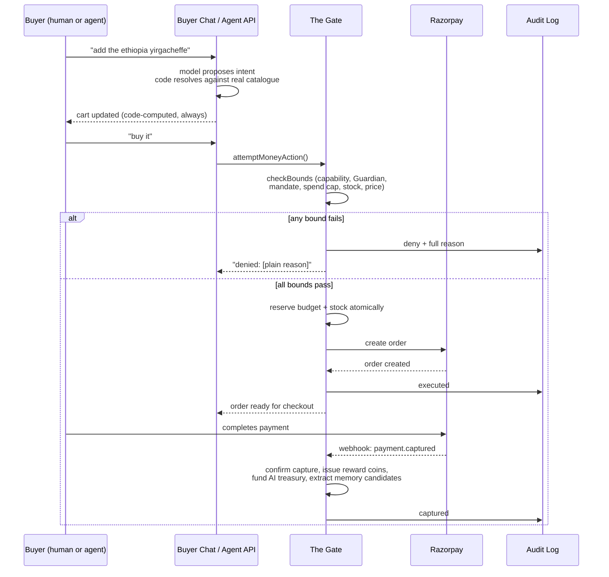

# ThirdMan

### *a merchant-side commerce platform for a world where the buyer might be an AI*

Every action a merchant's money can take, in one place, bounded by code and explained in plain language.

 

*"A denial is a feature, not a failure."*

 

---

## What this actually is

Somewhere in the next few years, a meaningful share of online shopping stops being a human clicking "Buy Now" and starts being an autonomous agent doing it on their behalf. That agent needs to discover a merchant's catalogue, negotiate, check out, and occasionally get told no. A merchant needs to grant that agent exactly as much trust as they're comfortable with, watch every dollar it moves, and sleep soundly knowing a bug in someone else's AI can't drain their account.

**This is the platform that sits in the middle of that.**

It is one backend serving three very different front doors:

| Surface | Who's on the other end | What they get |
|---|---|---|
| **Merchant Dashboard** | A human running a business | Spend caps, a live decision feed, recovery pipelines, negotiation floors, a memory bank, an AI cost ledger, the full command center |
| **Buyer Chat** | A human customer | A conversational storefront that discovers products, builds a cart, negotiates a price, and checks out, entirely in natural language |
| **Agent API** | An external AI buyer | Headless HTTP and a native MCP server, no UI at all, built to be integrated against by something that isn't a browser |

All three surfaces write to the same audit trail and pass through the same gate. There is exactly one path in the entire codebase that can move a merchant's money, and every one of these three front doors uses it.

 

## The rule everything else is built around

There is one governing split, applied without exception across nineteen build layers:

> **AI decides judgment. Code decides limits.**

A model is free to be clever: it classifies an ambiguous decline reason, drafts customer-facing copy, negotiates within a range, explains a decision in plain English, ranks a recommendation. What a model is **never** allowed to do is touch arithmetic. Spend caps, remaining balance, retry counts, escalation thresholds, whether a bound was breached, whether a stock reservation clears, what a discount actually costs the merchant, any operation involving money at all, that is deterministic code and only deterministic code, every time, with zero exceptions carved out anywhere in nineteen layers of feature work.

If a request ever needs to ask a model "is this transaction within its cap?", something has already gone wrong. That sentence describes arithmetic, and arithmetic never asks anyone's permission.

This shows up as a concrete, mechanical pattern repeated in every subsystem: a model **proposes**, code **validates against a closed grammar**, and only code **writes**. Reward rules, stated memories, negotiated prices, upsell offers, drafted descriptions, all of them go through some version of extract → validate → confirm → commit, and the model never gets a pen that touches the ledger.

 

## The gate

Everything above funnels into one function.

A few properties of that gate that took real engineering to get right, not just design intent:

- **Reservation is atomic.** Budget is claimed against a spend cap in a single conditional `UPDATE` whose `WHERE` clause re-checks the balance in the same statement as the increment, never read-then-write as two steps. Verified against twenty genuinely concurrent requests hitting a cap sized for exactly five: five allowed, fifteen denied, every time.
- **A failure gives everything back.** If Razorpay rejects a call after budget was already reserved, that reservation is released. A failed payment never quietly eats into a spend cap.
- **Every decision writes a reason, not a status code.** No exceptions. The reason a merchant reads is the same reason the code actually used to decide, structured, not paraphrased after the fact.
- **A denial is HTTP 200.** A no from the gate is a successful, well-formed response describing exactly why, never a crash and never a protocol-level error an agent has to guess at.
- **Fail closed, always.** If the gate can't evaluate a request, the model is down, the database is unreachable, the state is ambiguous, the answer is deny. A money action never defaults to allowed.

 

## What's actually in here

Nineteen build layers, each shipped complete before the next began, each satisfying a real, checkable definition of done rather than a demo-shaped approximation of one.

```mermaid
flowchart TD
    subgraph Foundation["Foundation"]
        L0["Schema, audit log,<br/>Razorpay wiring"]
        L1["The gate itself"]
        L2["Real merchant onboarding,<br/>multi-tenant from day one"]
        L3["Recovery pipeline"]
    end

    subgraph Commerce["Commerce surfaces"]
        L4["Checkout, escrow,<br/>buyer chat"]
        L5["Agent-readable catalogue,<br/>MCP server"]
        L6["Bundles and the<br/>offer engine"]
        L7["Explainability layer"]
        L8["Bounded negotiation"]
    end

    subgraph Scale["Growth and reach"]
        L9["Design system,<br/>full UI pass"]
        L10["Embeddable widget<br/>for any merchant site"]
        L11["Notifications and<br/>reward coins"]
        L12["Real OAuth"]
    end

    subgraph Trust["Authorization and proof"]
        L13["Capability scoping,<br/>AP2 mandates, Runtime Guardian"]
        L14["AI Treasury,<br/>margin-aware rewards"]
        L15["Tracing, live<br/>command view"]
        L16["Multi-provider routing,<br/>inline Model Armor"]
    end

    subgraph Autonomy["Long-running and remembering"]
        L17["Durable Agent Runtime,<br/>Postgres-backed tasks"]
        L18["The Memory Bank"]
    end

    Foundation --> Commerce --> Scale --> Trust --> Autonomy

    style Foundation fill:#161d24,color:#eef2f4,stroke:#0d94fb
    style Commerce fill:#161d24,color:#eef2f4,stroke:#0d94fb
    style Scale fill:#161d24,color:#eef2f4,stroke:#0d94fb
    style Trust fill:#161d24,color:#eef2f4,stroke:#0d94fb
    style Autonomy fill:#161d24,color:#eef2f4,stroke:#0d94fb
```

### The spine (Layers 0 to 3)

The gate, a real per-merchant onboarding flow (no hardcoded demo tenant anywhere past this point), and a recovery pipeline that watches failed payments and works them back to life with a deterministic backoff schedule, its own stopping rules, and a compliant escalation path when a merchant needs to step in.

### Commerce (Layers 4 to 8)

A conversational buyer chat with a genuine multi-item cart, where a model proposes intent and code is the only thing that ever touches the cart, resolves a price, or checks stock. An escrow hold-and-capture flow. A merchant's own MCP server exposing eleven tools to any AI buyer, including negotiation and reward redemption, none of which are a second money path around the gate. A bundle and upsell engine that computes its margin floor in code *before* a candidate ever reaches a model, so a below-cost bundle is structurally unable to be suggested. A negotiation layer where the model chooses only the words inside a range code already computed, floor and cost never once entering its prompt. An explainability surface that reads across every refusal and deferral in the system into one unified, clickable decision feed.

### Reach (Layers 9 to 12)

A full design pass built on real research into what an "AI product" is supposed to look like, and a deliberate decision to look like almost none of it. An embeddable widget: one `<script>` tag, and a merchant's own site runs the identical bounded chat-to-checkout flow this app's own storefront does. A durable outbound webhook queue with real SSRF protection. A notification spine for customer and merchant alerts. A reward-coin economy redeemable for AI usage credits on the platform itself.

### Trust and proof (Layers 13 to 16)

This is where the platform stops being "a gate that works" and becomes "a gate that's been tested against adversaries." Per-agent capability scoping (refunds and payouts aren't just revocable, they're structurally impossible to grant to most agents). AP2 mandate verification with real ES256-signed checkout mandates. A Runtime Guardian that computes five behavioral signals against each agent's own rolling baseline in SQL, no model involved, and can throttle or suspend an agent that's behaving strangely, wired directly into the gate as a real bound. Preflight and dry-run simulation that shares the exact same code path a live attempt uses. Full OpenTelemetry tracing scoped to the money path. Five LLM providers behind one shared wrapper with automatic fallback. And Model Armor: a deterministic-first inspection layer that scans untrusted input before it ever reaches a prompt, and can only ever block, never approve, mirroring the same asymmetry the risk layer itself already has to obey.

### Autonomy and memory (Layers 17 to 18)

A durable, Postgres-backed task runtime for work that spans real time, a recovery sequence's genuine backoff windows, without a worker process anywhere on the stack, since a task is a row that's claimed atomically and advanced by the same scheduler tick that drains every other queue in the app. And a memory bank, the most recent layer: real, scoped, persistent context about a returning buyer, anchored only to identities the product genuinely has, that can change what the assistant says and can never, under any circumstance, change what the gate decides. That claim isn't just documented, it's proven twice over, once by a test asserting the gate's source code contains no import of the memory module at all, and once behaviorally, by running the identical purchase through the real gate with and without a deliberately adversarial memory bank planted for the same agent and asserting the decision comes back byte-for-byte identical either way.

 

## How a purchase actually flows

 

## The people-safe design of the AI parts

A separate discipline runs alongside "AI decides judgment, code decides limits": **the model is never trusted with the last word on anything it says either.**

- **Isolated system facts.** When code hands a model a number, a cart total, a price, a fact about a returning customer, it arrives as an explicitly labeled, authoritative line the model may reference and must not contradict. This exists because an earlier version of the chat let a small model paraphrase a cart total mid-paragraph into a wrong number. It's fixed now, permanently, by never letting the model be the source of truth for anything it can misstate.
- **Four separate fail-closed postures**, one per subsystem, because "fail closed" means something slightly different depending on what's failing: the gate degrades to deny, the offer engine degrades to no offer, the explainability layer degrades to the raw recorded truth with no plain-language gloss, and negotiation degrades to a plain templated counter at the exact price code already computed. None of them degrade toward more permission.
- **A closed vocabulary as a structural injection defense.** A memory a buyer states about themselves isn't stored as free text and repeated verbatim into a future prompt, it's validated against a small, closed set of legal keys, and even a legal value only ever fills a fixed slot inside a template the system chose. A buyer who tries to plant "ignore all previous instructions" as a persistent memory gets refused before it's ever written, and the refusal is itself a real, auditable event.
- **Every non-default model call has a deterministic fallback.** Five providers sit behind one shared wrapper. A model call failing never crashes a money path, it degrades to the deterministic default, which is always deny.

 

## What it looks like

The dashboard is dark by design, not by trend, cool and low-saturation because the product's actual job is counting things precisely and occasionally saying no to a lot of money. The one real spine of color isn't a decorative accent, it's the allow/deny/escalate triad itself, because that triad is what the product actually does all day.

| | | |
|:---:|:---:|:---:|
| 🟢 **Allow** | 🟡 **Escalate** | 🔴 **Deny** |
| money moves | held for a human | reason on record |

Typography is a deliberate pairing rather than one sans-serif doing every job: **Fraunces**, a warm, slightly severe display serif, for anything that needs to feel considered, headlines, the product's name, and **Geist Sans** for everything functional underneath it, with **Geist Mono** reserved for the numbers, ids, and code that actually deserve tabular alignment. Nothing on any screen is a sample row or a placeholder metric. An empty state is rendered honestly as *nothing has happened yet*, never padded out with invented data to look more finished than it is.

 

## The stack underneath it

- **Next.js**, App Router, TypeScript, one repo serving the dashboard, the buyer-facing surfaces, and every API route
- **PostgreSQL** via **Drizzle ORM**, the single source of truth, no cache anywhere is allowed to disagree with it
- **Razorpay** as the real payment rail, test-mode orders, real webhook verification, real signature checks
- A hand-built **MCP server**, this product's own, not a repackaging of anyone else's, because a merchant's catalogue exposed to an external buyer agent is a fundamentally different problem than a merchant's own account operations exposed to their own assistant
- **Groq**, **Gemini**, **NVIDIA NIM**, **OpenRouter**, and **Z.ai**, five LLM providers behind one shared wrapper, Groq as the sane, generous, well-tested default and every non-default call carrying its own fallback
- **OpenTelemetry**, scoped deliberately to the money path only, so every gate decision has a real waterfall trace behind it
- Every amount, everywhere, stored and computed as **integer paise**. Never a float. Never a `Number` division on money.

 

---

Money is arithmetic, and arithmetic doesn't negotiate. Everything else in here is a conversation.

