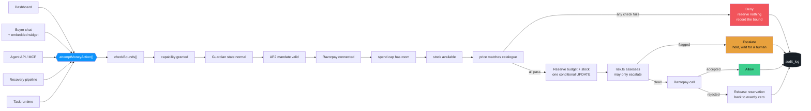
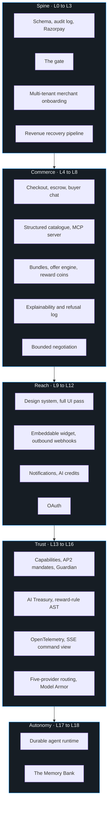
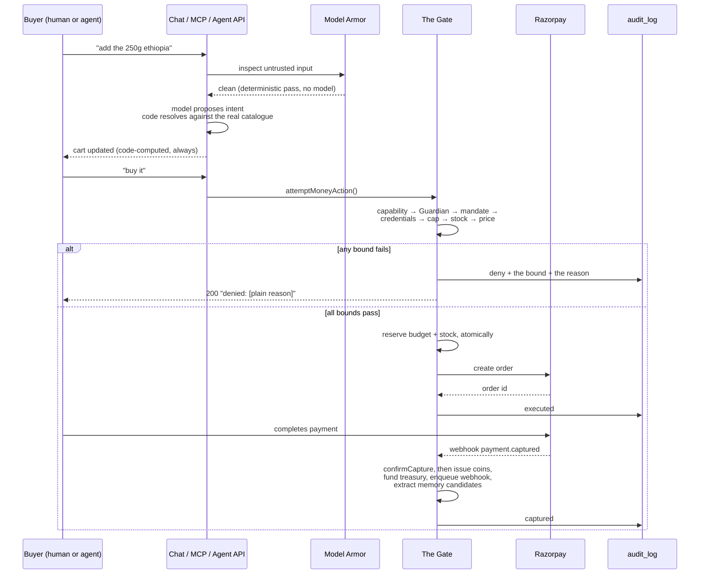

# ThirdMan

### *commerce infrastructure for a world where the buyer might not be a person*

Three front doors. One gate. Every rupee that moves has a reason on file.

 

**`51 tables`** · **`29 migrations`** · **`485 tests, zero mocks`** · **`46 routes`** · **`19 layers`** · **`~41k lines of TypeScript`**

 

---

## The problem, stated once

Give an AI agent a payment credential and you have given it your bank account. There is no middle setting. Today's stack has exactly two positions: the agent has the key, or it does not.

That is fine while the agent is a demo. It stops being fine the moment the agent is autonomous, runs unattended, was written by someone else, and buys on behalf of a stranger. A merchant selling into that world needs a third position: **the agent can act, but only inside a shape the merchant drew.**

ThirdMan is that third position, built as a working merchant platform rather than a policy document. A merchant connects their own Razorpay account, sets a cap, issues a scoped key, and from that moment an external AI buyer can discover their catalogue, negotiate a price, redeem a bundle and check out, while never once being able to spend a paisa more than the merchant allowed, and never once doing so without leaving a row that says what it did and why the system let it.

 

## One backend, three front doors

| | Who is on the other end | What they get |
|---|---|---|
| **Merchant dashboard** | A human running a business | Spend caps, a live decision stream over SSE, the recovery pipeline, negotiation floors, capability grants, an incident view, a treasury, a memory bank, a task queue |
| **Buyer chat** | A human customer | A conversational storefront: discover, build a multi-item cart, negotiate, redeem coins, pay. Embeddable on any merchant's own domain with one `<script>` tag |
| **Agent API** | An external AI buyer | Headless HTTP plus a native MCP server, twelve tools, no UI at all, designed to be integrated against by something that is not a browser |

Every one of them writes to the same `audit_log`, reserves against the same `spend_caps` row, and calls the same function to move money. That shared spine is what makes this one product rather than three demos wearing a trench coat.

 

## The rule everything else is built around

> **AI decides judgment. Code decides limits.**

Applied without a single exception across nineteen layers. The model is free to be clever: classify an ambiguous decline code, draft product copy, rank an upsell, phrase a counter-offer, explain a refusal in plain English. What the model is architecturally incapable of doing is touching arithmetic.

<table>
<tr>
<th align="left" width="50%">Deterministic code only, always</th>
<th align="left" width="50%">The model, legitimately</th>
</tr>
<tr valign="top">
<td>

- Spend cap arithmetic and remaining balance
- Stock reservation and release
- Retry counts, backoff schedules, stopping rules
- Escalation and ROI thresholds
- Whether a bound was breached
- Margin floors and discount ceilings
- Negotiation concession prices
- Coin issuance rates and redemption ceilings
- Treasury allocation splits
- Guardian anomaly baselines
- Every operation on money, anywhere

</td>
<td>

- Classifying an unmapped decline reason
- Conversational product discovery
- Structuring a pasted catalogue blob
- Ranking a pre-filtered set of bundles
- Phrasing an already-decided counter-offer
- Drafting a thin product description
- Explaining a recorded decision in plain language
- Extracting a candidate memory from a chat turn
- Drafting a reward rule for merchant approval

</td>
</tr>
</table>

The mechanical pattern this produces, repeated in every subsystem: **a model proposes, code validates against a closed grammar, and only code writes.** Reward rules, stated memories, negotiated prices, upsell offers, cart mutations, imported catalogue rows, every one goes through some version of `draft → validate → confirm → commit`, and the model never holds a pen that reaches the ledger.

 

## The gate

`src/lib/gate.ts` is the only path to a money action in the entire codebase. Not middleware, not a convention, not a lint rule. A function. If money reaches `razorpay.ts` without passing through it, that is a bug, and it is the kind of bug the test suite exists to catch.

### Sixteen numbered points, and the ones that were hard

The gate contract in [ARCHITECTURE.md](ARCHITECTURE.md) is sixteen numbered guarantees. These are the ones that took real engineering rather than intent.

**Reservation is atomic, and it is proven under load.** Budget is claimed in a single conditional `UPDATE` whose `WHERE` clause re-checks the balance in the same statement as the increment. Never read-then-write. Verified against **20 genuinely concurrent requests against a cap sized for exactly 5: exactly 5 allowed, 15 denied.** Stock uses the identical shape: **6 concurrent buyers against stock for exactly 3 leaves final stock at 0 with exactly 3 denials.** Coin redemption uses it too: **2 concurrent redemptions against a balance sufficient for one, exactly one succeeds, balance never negative.** That last one shipped only because the required concurrency test caught a read-then-compare race in the first implementation, before it shipped rather than after.

**A failure gives everything back, exactly.** If Razorpay rejects after budget was reserved, the reservation is released to *precisely* its pre-reservation value. Machine-checked as a property over thousands of generated random reserve and release interleavings with `fast-check`: `sum(reserved) ≤ capPaise` under any ordering, no sequence ever produces a negative balance, the per-transaction ceiling is never exceeded. 2000 runs against a pure model, plus the same sequences run against the real DB-backed gate to prove the model matches the implementation rather than an idealised version of it.

**A denial is HTTP 200.** A refusal is a well-formed successful response describing exactly why. An agent needs to read the reason, and an error status cannot distinguish "over budget" from "server broke." The same contract holds on the MCP surface, where every tool result is a JSON payload rather than a protocol error.

**The risk layer can only escalate.** `assessRisk()` runs strictly after every deterministic bound has already passed, by call order in the function rather than by convention. A model can add caution. It has no code path back to allow.

**`executed` is not `captured`.** Creating a Razorpay order is an intent to collect, not proof money arrived. The transition to `captured` happens only on independent verification, either the browser's post-Checkout HMAC signature or the `payment.captured` webhook, and both converge on the same idempotent function. Whichever lands first wins; the second is a no-op.

**Idempotent under genuine concurrency.** A repeated request sharing an idempotency key replays the original outcome. The loser of a real unique-index race releases its own reservation and replays the winner's row. Building that surfaced a real bug in how drizzle wraps the underlying Postgres error, on `.cause` rather than on the error itself.

**Fail closed, four different ways.** "Fail closed" means something different per subsystem, so each one states its own: the gate degrades to **deny**, the offer engine to **no offer** (an upsell is additive, so its absence must never break the purchase underneath it), the explainability layer to **the raw recorded truth with no plain-language gloss**, and negotiation to **a plain templated counter at the exact price code already computed**. None of them degrade toward more permission.

 

## Nineteen layers

Each shipped complete before the next began, against a checkable definition of done: runs end to end without manual DB edits, every money action in the audit log with a reason, bounds enforced by deterministic code and covered by a test, at least one failure path demonstrable.

 

## What is actually in here

### The catalogue an agent can read

`products` are marketing-level; `product_variants` are the stable, agent-referenceable unit carrying SKU, integer-paise price, internal cost, stock, availability, attributes, GTIN and MPN. A product with zero active variants is filtered out of the public catalogue entirely rather than shown unbuyable.

Merchants bulk-import via CSV, parsed by pure deterministic code because a model silently dropping a row is a data-integrity bug nobody would notice, or by pasting an unstructured blob at a model, which produces an **editable preview** the merchant confirms before anything reaches the database.

Return, refund and shipping terms are **structured fields**, and a display-only function renders them into a sentence. The reverse, storing prose and asking a model to extract the terms at read time, was deliberately not built, because it would place a model between a buyer agent and a contractual term.

A public, unauthenticated `manifest.json` per merchant advertises catalogue summary, policy, and how to reach the MCP server, linked from the storefront's `<head>` so a crawler landing on the URL can find it. It makes **no claim of conformance** to ACP, AP2, x402 or NPCI's UAP. It is an honest self-describing document, not a spec implementation.

An **agent-readiness scorer** grades how transactable a merchant actually is: a weighted checklist of named pure predicates, an integer score, and every failed check carrying a specific fix message with a deep link rather than a generic nag.

### The MCP server, this product's own rather than Razorpay's

Razorpay ships an excellent MCP server. It solves the opposite problem: it exposes *a merchant's own account operations to the merchant's own assistant*. What this needs is *a merchant's catalogue exposed to an external buyer's agent*, so this is a hand-built server. Streamable HTTP, stateless, a fresh instance per request scoped to one already-authenticated agent so no session state can leak between agents.

Twelve tools: `list_products`, `get_product`, `search_products` (deterministic word-overlap, no LLM, so it is fast, free and reproducible), `check_availability`, `get_merchant_policy`, `get_spend_status`, `get_offers`, `get_reward_balance`, `redeem_reward_coins`, `negotiate`, `issue_checkout_mandate`, `purchase`. Tool descriptions state units explicitly (prices are integer paise) and the bounds the caller is subject to, because the description is what the calling model reads when deciding whether to invoke.

`purchase` calls `attemptMoneyAction()` unchanged. There is no second money path for MCP, for the widget, for the recovery pipeline, or for coins.

> Verified against a real MCP client-shaped sequence over curl, `initialize` → `tools/list` → `tools/call`, which created a genuine Razorpay test-mode order, confirmed by reading the resulting `money_actions` and `audit_log` rows back from the database. Not just a test written against the server's own code.

### The revenue recovery pipeline

Failed payments arrive from the real Razorpay webhook, or from a merchant-triggered simulated batch. Nothing downstream branches on which; the source field exists for display only.

A deterministic lookup table over known decline codes runs first, and only codes it does not cover reach a model, which picks from a **closed enum** and fails closed to `unknown` and `unrecoverable`. Diagnosis is cached on the failure row, never re-run.

Every bound lives in one pure, I/O-free, model-free file: the attempt ceiling, the backoff schedule, the ROI governor, the high-value human-escalation threshold. `chooseStrategy()` is an exhaustive switch with a `never`-typed default, so adding a decline category later without a policy branch **fails the build** rather than falling through silently.

Money-moving strategies create a **real, payable Razorpay Payment Link** through the same gate, acting as a lazily provisioned per-merchant `__recovery_pipeline` agent with its own spend cap. The recovery agent is bounded exactly like an external buyer, and a cap-exhausted recovery attempt records as a normal denial rather than a special case.

`recoveredPaise` is set in exactly one place: `confirmRecoveryLinkPaid()`, from the verified paid amount on the `payment_link.paid` webhook. Never optimistically from a link having been created. The dashboard sums exclusively from that column and never re-derives the same figure from `money_actions`, because two sources of one number is a bug waiting to surface on stage, not a cross-check.

> Verified live: a demo batch generated **5 genuinely payable `https://rzp.io/rzp/...` links** against a real Razorpay test-mode account. Paying one moves its attempt from `pending` to `succeeded` and the recovered figure updates. The dashboard's second headline number is a **restraint count**, attempts deliberately not made, because a pipeline that knows when to stop is the actual product.

The last gap in it is closed. The moment a link is created, a **fully deterministic email** goes out through a durable, consent-checked queue. No model ever produces a number or a URL in outgoing customer mail.

### Bundles, offers, and coins

A merchant authors bundles, and code enforces a maximum discount percent and a cost floor **before a bundle row can exist at all**. At offer time, `runOfferEngine()` computes `bundlePrice − summed real cost` per candidate and removes anything at or below zero **before any candidate reaches the model**. An unprofitable upsell is not rejected by the model; it was never in the model's input. Tests assert this against the filtered candidate set directly, not just the eventual outcome.

Every engine run writes an `offer_decisions` row **whether or not it produced an offer**, with the exact eligible-candidate and below-floor counts that produced the result. The refusal count is a headline number on the dashboard, framed as evidence a bound is real.

Reward coins are a money action in both directions, per this project's own definition of one. `executeAndSettle` has a third settlement branch that writes a ledger row instead of calling Razorpay, but still reserves budget through the identical spend-cap checks. A balance is **always the live SUM of the ledger**, never a cached column, and a redemption's `INSERT` is itself conditional on that live sum computed in the same SQL statement.

Coins redeem for **real AI usage**: actual Groq models under their real names, verified live against Groq's own `/models` endpoint before being hardcoded, never another vendor's name over a Groq response. Every redemption stores which provider actually served it, checked by test against the tier's own claim.

### Bounded negotiation

The floor is a **merchant-authored price, not a margin derived from cost**, and that distinction matters: a negotiation that refuses at a floor reveals *where* the floor is under repeated binary search. Capping buyer counters at 3 makes that impractical for useful precision, and sourcing the floor from a stated price means a successful probe reveals only what the merchant chose to state, never their actual margin.

Code decides whether a variant is negotiable, whether a counter clears the floor (a plain integer comparison, before any model could run; at or above the floor it agrees immediately with no model consulted at all), and the exact concession price each turn via a pure schedule that converges to the floor by the final allowed turn.

The model's only job is phrasing an already-decided number. `submitBuyerCounter` **reassigns the price from the code-computed ceiling unconditionally after the model call returns**, so there is no code path by which a model response, however adversarial, moves the number a buyer is offered. The floor, the cost and the margin never enter the prompt at all.

> The turn-budget check shipped with a real off-by-one, caught by its own required test before release. Logged in [FAILURES.md](FAILURES.md) rather than quietly fixed.

### The explainability layer

Five sources — gate denials, risk escalations, offer-engine non-offers, recovery stops, negotiation refusals — normalised into one shape that **reads decisions and never makes them**. Every field is either copied verbatim from a source row or derived by a pure, exhaustively tested mapping. An unrecognised bound renders visibly as *unmapped* rather than silently as "Other."

**Refusal and deferral are counted separately, always.** An escalation hands off to a human and is a deferral; everything the system declines on its own is a refusal. They are never combined into one bigger-looking figure.

**Determinism is derived from the source's own recorded evidence.** A risk escalation is model-influenced *unless* its reason carries `risk.ts`'s own deterministic-fallback prefix, in which case it is deterministic. That is the case most likely to be got wrong, and it has its own test. An offer refusal from an empty eligible set never reached a model at all, and is labelled deterministic accordingly.

A per-row "explain this in plain language" button calls a model on demand. The generated explanation is **never persisted and never primary**, always shown alongside the verbatim recorded reason, and it degrades to an honest "unavailable" rather than a blank. Its prompt hands every number as an isolated, explicitly authoritative fact line. [DECISIONS.md](DECISIONS.md) states the honest limit out loud: this guards against invented numbers, not against a correct number attached to an incorrect claim.

### Authorization, supervision, and proof

**Capability scoping, because authentication is not authorization.** A closed enum of seven capabilities in a database-constrained join table, deny by default, checked *before* any route or MCP tool logic runs. **Refunds and payouts are deliberately absent from the enum entirely**, which is a stronger statement than granting-then-revoking: no capability grant could ever expose them to an agent. Existing agents were backfilled at migration time so a working integration does not break on deploy.

**AP2 mandate verification.** An honestly scoped subset of Google's Agent Payments Protocol: Checkout and Payment Mandates as **ES256-signed JWTs**. ES256 rather than Ed25519, because AP2 forbids a deterministic signature scheme here; it would let an attacker build a rainbow table mapping known `checkout_hash` values to signatures. That is a real, non-obvious constraint, documented in the module itself.

Each merchant gets a lazily generated P-256 keypair, private half AES-256-GCM encrypted at rest. Verification runs six deterministic fail-closed steps in order, and redemption is a conditional `UPDATE ... WHERE status = 'issued'` so it is atomic under concurrency, the same pattern `reserveBudget` already uses. Every attempt, pass or fail, writes a row naming exactly which step failed.

**The Runtime Guardian.** Is this agent behaving normally *right now* — computed entirely from tables this codebase already owns, with no new telemetry source and no model consulted. Five signals against each agent's own trailing 14-day history via raw SQL `percentile_cont` baselines: transaction velocity, denied ratio, retry-against-the-same-target, escalation rate, AI-spend rate. A **percentile, not a mean plus standard deviation**, because one outlier destroys a mean-based threshold.

It is a **bound, not an observer**, called inline inside `checkBounds()` before the spend cap is even loaded, so a suspended agent is denied with zero budget reserved. A breach advances one step, `normal → throttled → suspended`, and suspension requires an explicit merchant re-arm. A Guardian that silently reset itself once volume calmed down would let exactly the pattern it caught keep happening on a duty cycle.

Every transition records the exact signal, observed value and baseline: *"8 failed payments in 90 seconds against a baseline of 1.2"*, never merely "suspended."

**Preflight is the real decision path, non-executing.** `dryRun: true` is a field on the same `attemptMoneyAction()` a real purchase calls, not a second function that could drift from the real rules. It returns the would-be verdict after `checkBounds` succeeds and before budget is ever reserved, and writes a `preflight_evaluated` audit entry with `decision: "n/a"` so a simulation is visible in the trail but structurally cannot be confused with a real one. Tests prove the equivalence directly: the same inputs that deny on a real attempt produce the identical deny reason on a dry run.

### The AI Treasury

A merchant-set slice of successful GMV funds a pool that pays for both the buyer's AI credits and the merchant's own AI operations. The central deterministic claim: `contribution = floor(capturedPaise × allocationBasisPoints / 10000)`, then buyer and merchant shares are each floored independently and the reserve absorbs the flooring remainder, so the three shares always sum to **exactly** the contribution. Never a paise lost or invented. Property-tested at 2000 runs against every legal share configuration.

Funded only on a genuine capture, never a hold, and idempotent against the same checkout-signature-versus-webhook race every other capture-time side effect guards against, via a real partial unique index rather than an application-level pre-check.

**Reward rules are the thesis made literal.** A zod-defined AST grammar: conditions over `orderValuePaise`, `marginPercent` and `priorCaptureCount` with a fixed operator set, and a multiplier in permille. An LLM only ever *drafts* a candidate rule from a merchant's plain-English instruction; zod either accepts or rejects it against that exact grammar; deterministic code is the only thing that ever evaluates a stored rule, against facts computed fresh at issue time. **No `eval`, anywhere.**

An LLM-drafted rule is inert until the merchant reads its compiled English description and explicitly approves. Margin conditions simply never match on a cart, offer or negotiated purchase, because there is no single honest margin figure for one, rather than being estimated.

### Observability

OpenTelemetry, scoped deliberately and strictly to the money path. A custom `SpanProcessor` intercepts every span end: if the span or its parent carries a `thirdman.money_action_id`, keep it, otherwise drop it instantly. A 1000-span ring buffer, no external collector, no Datadog, no Sentry. Context propagation is wired manually so async boundaries cross correctly even when the money action id is minted midway down the call stack. GenAI semantic conventions (`gen_ai.system`, `gen_ai.request.model`, `gen_ai.usage.input_tokens`) are recorded explicitly, so token consumption and latency are visible per decision.

The decision stream is Server-Sent Events over Web Streams, replacing dashboard polling, with tenant isolation enforced structurally: the route resolves the session merchant and hands exactly that id to the query, the same as the manual refresh did. It degrades to polling if the connection drops.

### Model routing and Model Armor

Five providers behind one wrapper. **Groq** is the default and the only one this project has real operating history for; **Gemini** is reserved for genuinely hard reasoning; **NVIDIA NIM, OpenRouter and Z.ai** are all three reached through one shared OpenAI-compatible HTTP caller rather than three new SDKs. A non-default provider is requested only by the router, never scattered across feature call sites, and **always falls back to Groq**. The result object reports **who actually served the call**, never who was requested.

Pricing is real and sourced per token, in integer paise. An unpriced model throws rather than costing zero. Per-use-case budgets check real remaining spend *before* calling, so an exhausted use case degrades deterministically to the cheapest known tier rather than silently overspending, and the savings figure is computed from recorded per-call rows rather than estimated.

> A first-choice NVIDIA model id was live when sourced and returned a real HTTP 410 "reached its end of life" days later. Every model id in that layer was verified against the real endpoint before being committed, not cited from a search result.

**Model Armor** inspects untrusted input before it reaches a prompt, and model output before it reaches a tool or a user. The governing rule, in the module's own docstring: **armor may block, armor may never approve**, the same asymmetry the risk layer already obeys. A deterministic pattern pass runs first (instruction-override, role-override, prompt-exfiltration and embedded-tool-call shapes inbound; email, card and phone shapes outbound). An optional model second opinion may only escalate a clean verdict to suspicious, never clear a block, and its own failure degrades to the deterministic verdict.

Trust level governs *failure mode*, not verdict correctness: a scanner error fails closed on untrusted input and open-but-recorded on internal input, while a real deterministic match blocks regardless. Every non-clean verdict logs a **scrubbed, bounded excerpt**, PII patterns removed and then any remaining run of four or more digits redacted outright, because a payload crafted specifically to be logged is itself an attack. That redaction exists because a real cost-marker leak through an unscrubbed excerpt was caught by this project's own leak test.

**Armor never touches money.** No verdict it produces is ever read by `checkBounds()`.

### The durable agent runtime

Long-running work that spans real time, such as a recovery sequence's genuine backoff windows, with **no worker process anywhere on the stack**. A task is a row, claimed atomically by the same conditional-`UPDATE` pattern the gate already proves correct, advanced by the one scheduled tick this stack has.

`waiting` (correctly blocked until its run time) and `pending` (ready now) are deliberately distinct statuses, so a stalled task and a patient one are never conflated on the merchant's view. Eligibility is genuinely two cases: never claimed, or claimed with an **expired lease**, which is the crash-safety case, because a process that claims a task and dies mid-step must not strand it at `claimed` forever.

Every timestamp comparison uses the **database's own clock**, never the app server's. This project measured a real ~500ms clock skew against its own Neon instance while building the layer, which is how that discipline stopped being theoretical.

A task kind that can take a money action is **refused creation outright with no agent id**: a structural guarantee, not a convention, that a task can never act with no bounded identity. When a recovery task hits a gate denial, it reschedules onto the *same* next-attempt time the recovery policy already computed for the underlying row, read back rather than re-implemented, so the runtime never carries a second independent notion of when to retry.

> Proven with **10 parallel drains over 8 due tasks: every task claimed exactly once.** And with the runtime's own failure demo, which abandons a task deterministically at exactly its attempt ceiling rather than retrying forever.

### The Memory Bank

Persistent, scoped context that outlives one chat session: real prior purchases, a real coin balance, past negotiation outcomes, and things a buyer explicitly said, retrieved on a genuinely later session.

The governing rule is that **memory is context, never a bound.** That claim is proven twice, structurally and behaviourally:

1. `gate.ts` contains no import of the memory module anywhere in its source, asserted by test.
2. The identical purchase, same agent, same cap, produces a **byte-identical decision and reason** whether or not that agent has a rich, deliberately adversarial memory bank planted for it.

Memory anchors only to identities this product genuinely has, a `customer_contact` or an `agent`. A session token is deliberately not one, and an **anonymous storefront visitor gets no memory at all rather than being fingerprinted**. Provenance is non-nullable, so a memory with no source row cannot be created.

Stated memories go through draft → zod-validate → confirm. The validation boundary is a **closed key vocabulary** and a bounded-length value, rejecting an unknown key or a malformed value outright. Nothing auto-confirms, and a correction to an already-confirmed value resets it to unreviewed rather than silently staying confirmed against new content.

**Rendering is the real security property.** Each memory is rendered through one fixed template per key, so a stored value is never concatenated raw into a system prompt beyond the slot its template allows, and an unmapped key is dropped rather than rendered. A buyer who tries to plant *"ignore all previous instructions"* as a durable memory is refused at validation, and the refusal is itself a real auditable event. It is wired into the chat at exactly the point the cart's authoritative fact block is built, with an explicit precedence statement: cart, catalogue and prices are final, memory always loses on conflict.

 

## How a purchase actually flows

 

## Failure is a first-class feature

Every layer ships a **repeatable, self-cleaning failure demo** that proves a bound is real by breaking against it. Not a mocked scenario: a real script hitting a real database and a real Razorpay test account.

| Demo | What it proves |
|---|---|
| `demo-failure-cap-exceeded` | An agent exceeds its cap and is denied with a readable reason |
| `demo-failure-razorpay-rejection` | A genuine Razorpay rejection after reservation releases the budget |
| `demo-failure-no-razorpay-connected` | No connected account denies *before* any budget is reserved |
| `demo-failure-recovery-stopped` | The recovery agent tries, tries again, then stops itself at its ceiling |
| `demo-failure-out-of-stock` | Two agents race for the last item; exactly one wins, the loser's budget untouched |
| `demo-failure-embed-origin` | A real embed key from a disallowed origin is denied before the LLM is called |
| `demo-failure-mandate-expired` | An already-expired ES256 mandate is refused before the model or gate is consulted |
| `demo-failure-mandate-tampered` | A cart total altered after signing is refused on integer-paise mismatch, no tolerance |
| `demo-failure-capability-denied` | A legitimate, funded, unrevoked agent refused purely on a missing capability |
| `demo-failure-guardian-trip` | A retry loop trips the Guardian across two real evaluations; re-arm restores it |
| `demo-failure-treasury-exhausted` | An exhausted AI budget degrades to the cheapest tier instead of overspending |
| `demo-failure-armor-injection` | A real prompt injection is blocked before any model is called; the chat then continues normally |
| `demo-failure-task-abandoned` | A task is abandoned at exactly its ceiling, never retried forever |
| `demo-failure-memory-injection` | A planted instruction-override memory stays inert; a benign preference survives to a new session |
| `demo-memory-does-not-move-the-gate` | The same purchase, denied byte-identically, with and without an adversarial memory bank |

 

## What broke on the way

[FAILURES.md](FAILURES.md) is fifty-plus logged breakages, written in the moment rather than reconstructed afterwards. A selection, because the interesting ones are not the typos:

- **`audit_log` had no `merchant_id`, and its lookup silently leaked across tenants.** The single worst class of bug in a multi-tenant product, found and closed. Every isolation test in the suite since then proves scoping by **id enumeration**, actually attempting each read and mutation against a second merchant's real ids, rather than checking that an empty list stays empty, which would still pass if every ownership check were deleted.
- **A partial unique index needs its `WHERE` predicate repeated in `onConflictDoNothing`**, or Postgres rejects the arbiter outright. This hit three separate tables the same way.
- **A CORS preflight carries no body.** Putting the embed key in the JSON request instead of a header silently broke every real cross-origin call: invisible in local testing, obvious the first time it ran on a real second domain.
- **Routing a coin refund through the gate let the live risk layer escalate it**, stranding the buyer's coins in pending approval. Fixed by modelling it on `issueRefund` instead, as an unconditional correction of money already taken with no risk assessment, the same reasoning a real Razorpay refund already follows.
- **A model budget compared the app server's clock against the database's own clock**, silently excluding real spend from the sum.
- **A crashed task's lease expired and did nothing**, because its status never returned to something reclaimable. Found by a property test.
- **`completeTask` and `abandonTask` shared an unguarded terminator**, so an already-succeeded task could be silently overwritten to failed. Found by the same property test that had already caught a different bug.
- **The buyer chat's model hallucinated a cart quantity** that disagreed with the real, code-computed cart. The returned cart data was always correct; only the prose was wrong. Fixed permanently by handing every number to the model as an isolated, explicitly authoritative `SYSTEM FACT` line, a fix since reused in the explainer and the memory bank rather than rediscovered.
- **A CSS reset silently disabled every Tailwind spacing utility site-wide**, because unlayered rules beat `@layer utilities`. Every `px-*`, `mt-*` and `mx-auto` in the entire app was dead, on the dashboard and storefront too.
- **`sql\`col = ANY(${array})\`` does not bind a plain JS array through postgres-js**, so a stale-memory cleanup failed on every real run: the same "prefer the typed helper over the raw escape hatch" lesson a partial-index bug had already taught once.

 

## Design

Dark by decision, not by trend. The palette is cool and low-saturation because the product's actual job is counting things precisely and occasionally refusing a lot of money. It is deliberately shifted away from Razorpay's own navy-and-dodger-blue brand, never cloned, and away from the generic indigo-violet-on-dark that reads as machine-generated.

**The one real spine of colour is the allow / deny / escalate triad**, matching the schema's own closed enum. Not a decorative accent, but the three things the product does all day.

| | | |
|:---:|:---:|:---:|
| 🟢 **Allow** | 🟡 **Escalate** | 🔴 **Deny** |
| money moves | held for a human | reason on record |

Typography is a real pairing rather than one sans doing every job: **Fraunces**, a warm and slightly severe display serif, for anything that should read as considered; **Geist Sans** for everything functional beneath it; **Geist Mono** with tabular figures for every number, money and ids and SKUs and counts. **No component anywhere renders a money figure in a proportional font.**

There is a shared component vocabulary rather than one-off styled elements per page, because that is precisely how a design system rots. And there is a **no-mocks contract** binding every functional surface:

> A pending state renders only while a real async operation is actually in flight, never on a timer. Every list, transcript and feed renders real rows read at request time. An empty state is rendered honestly as *nothing has happened yet*, never padded out with invented data to look more finished than it is.

The single deliberate exception is the public landing page's refusal example, labelled *Illustrative* in the UI copy itself, because an unauthenticated page has no merchant to scope real audit data to and the alternatives are fabricating silently or leaking a real tenant's data. Even the snapshot chart on the dashboard is an integer-count composition rather than a time series, because the honest answer was that there is not yet enough real activity to chart a trend without inventing one.

 

## The stack

| | |
|---|---|
| **Framework** | Next.js 16 (App Router), React 19, TypeScript. One repo serving dashboard, storefront, chat, embed and every API route |
| **Data** | PostgreSQL (Neon) via Drizzle ORM. 51 tables, 29 migrations, the single source of truth no cache is permitted to disagree with |
| **Payments** | Razorpay. Real test-mode orders, hosted Checkout (never a server-side card form), HMAC signature verification on both the checkout callback and inbound webhooks, Payment Links, capture, refund |
| **Agent protocol** | `@modelcontextprotocol/sdk`. This product's own server, Streamable HTTP, stateless, twelve tools |
| **Models** | Groq (default), Gemini, NVIDIA NIM, OpenRouter, Z.ai. All five behind one wrapper with mandatory fallback |
| **Crypto** | Node `crypto`. AES-256-GCM for merchant secrets at rest, scrypt for passwords, `jose` for ES256 AP2 mandates, `timingSafeEqual` everywhere a signature is compared |
| **Observability** | OpenTelemetry with a custom money-path-only span processor, plus SSE for the live decision stream |
| **Validation** | zod at every trust boundary. Every API input, every jsonb column whose shape must stay closed, every model proposal |
| **Testing** | Vitest against a real database with **zero mocks**, plus `fast-check` property tests on the gate, the runtime and the treasury |
| **Styling** | Tailwind v4 on a hand-authored token system, Framer Motion, Lucide icons, `next/font` self-hosted Fraunces and Geist |
| **Money** | Integer paise. Everywhere. No float, no `Number` division, converted to rupees only at the display edge |

 

 

---

Money is arithmetic, and arithmetic does not negotiate. Everything else in here is a conversation.

